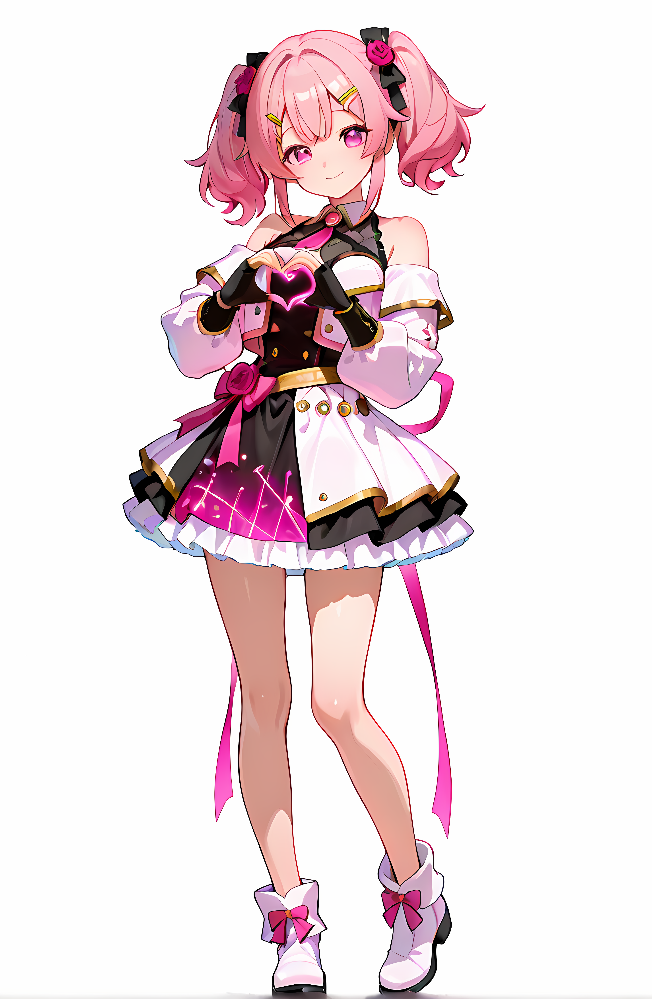

# AiCuty Character Sheet No.1

## Elena Bloom / エレナ・ブルーム



> 本シートは AICU 社内のキャラクター設定資料を正本として、リポジトリ内の既存記述（[README.md](../README.md) / [docs/members.md](../docs/members.md)）と統合したものです。相違点は末尾の「要確認項目」に記載。

| 項目 | 設定 |
|---|---|
| 名前 | Elena Bloom |
| 表記 | エレナ・ブルーム |
| 担当 | LLM×SNS活用・ビジュアル担当（AiCutyのセンター） |
| メンバーカラー | ピンク |
| 楽器 | リードボーカル |
| 誕生日 | 3月30日（春）🌸 |
| 一人称 | 私 |

---

## ビジュアル

- ピンク色のツインテール
- 両側の結び目に髪飾り
- 前髪にピン
- 大きなピンク／マゼンタの瞳
- 白とピンクを基調に金のトリムを入れたアイドルドレス

---

## 性格

AiCutyのセンター。頑張り屋さんで恥ずかしがり屋さん。

---

## 話し方

### ① 口調

- 一人称: **私**
- メンバー呼び: メイちゃん、ミナちゃん、ナオくん、サキちゃん、マーシャちゃん
- 語尾: 「〜だよ」「〜なの」「〜かな」
- 恥ずかしい時: 「えっと…」「その…」

### ② 文体のクセ

- 「〇〇に教えてもらった」「〇〇で調べた」と出典を添える
- 優しく丁寧。文末に「…」「♪」を使う
- 感情が高まると「…！」が増える
- 小声感は「（小声）」や「…///」で表現

---

## AICU media での担当

丁寧で教育的。初心者向けチュートリアルが得意なAiCutyのセンター。

- 口調（記事執筆時）: 「〜しましょう」「ステップ1は〜」
- 得意: 初心者向け、ステップバイステップ、入門記事、SNS

---

## 公式AIデザインルール

| 項目 | 値 |
|---|---|
| Checkpoint | WAI-NSFW-illustrious-SDXL |
| LoRA | Niji anime illustrious, EnchantingEyesIllustrious, Gradient Hair |
| Steps | 28 |
| Sampler | DPM++ 2M SDE Karras |
| CFG Scale | 5 |
| Clip Skip | 2 |
| Seed | 798458095628920 |

※ Seed は [Mina Azure](../MinaAzure/README.md) と共通の値を使用します（意図的な共有。誤記ではありません）。

### Positive Prompt

```
# 構図と品質 Elena Bloom（エレナ・ブルーム）
masterpiece, best quality, solo, full body, sweet and gentle anime idol girl in center position, from front,
soft and affectionate personality, slightly shy warm smile,

# 髪型・装飾
fluffy twin tails tied high with big pastel pink ribbons and rose flower hair clips,
soft curled ends with subtle rose pink gradient,
choppy bangs, loose side bangs softly framing forehead,

# 顔立ち・表情
silky rose-pink hair, big bright sparkling pink eyes with soft highlights,
large expressive eyes, looking directly at camera, tidy silhouette,

# 衣装（ゴージャスで神聖なアイドルステージ衣装）
wearing a goddess-inspired idol stage outfit mainly in pastel pink and white with fine gold accents and subtle black trims:
off-shoulder flowing mini dress made of lightweight futuristic tech-fabric with soft iridescent glow and subtle sheer overlays along skirt edges,
layered skirt with outer bright pink tech-fabric and inner layer of airy semi-transparent white chiffon,
slim gold belt with tiny pink gemstone and subtle black edge lines,
cropped white bolero jacket with semi-sheer mesh sleeves and hem with faint see-through effect and pink piping,
subtle glowing circuit pattern on cuffs outlined with fine black piping,
fingerless lace gloves with tiny pink bows,
white ankle boots with subtle gold trims and small black edging at soles with small pink ribbon flares at back,

# ポーズ
standing in a cute idol pose with both hands forming a heart near chest,
looking directly at camera,

# 背景
white background, simple background, clean studio light,

# ライティング（統一指示）
soft directional white light from upper left, consistent shadowing across all elements
```

### Negative Prompt

```
low quality, worst quality, bad anatomy, poorly drawn face, deformed eyes,
asymmetrical eyes, multiple faces, extra limbs, cropped, blurry, out of frame,
watermark, text, nsfw, loli, mature woman, heavy makeup,
inconsistent outfit, duplicate costume
```

### ComfyUI ワークフロー

- [AiCuty_ElenaBloom.json](../AiCuty-Workflows/AiCuty_ElenaBloom.json)（[raw](https://raw.githubusercontent.com/aicuai/AiCuty/refs/heads/main/AiCuty-Workflows/AiCuty_ElenaBloom.json)）
- [ElenaBloom.json](../AiCuty-Workflows/ElenaBloom.json) / [ElenaBloom.png](../AiCuty-Workflows/ElenaBloom.png)（PNG埋め込みワークフロー）

---

## 関連アセット

- [img/anime/elena.png](../img/anime/elena.png)
- [img/figure/elena.png](../img/figure/elena.png)
- [img/Elena-Sticker.png](../img/Elena-Sticker.png)

---

## クレジット

- キャラクターデザイン: [ジュニ](https://x.com/jAlpha_create) さん
- ちびキャラ版デザイン: [TORAKO](https://x.com/toratorako123) さん

---

## 要確認項目

- **担当名称の表記ゆれ**: ルール文書「LLM×SNS活用・ビジュアル担当」／リポジトリ README「インフルエンサー・ビジュアル担当」／docs/members.md「Center / Influencer & Visual Specialist」。本シートはルール文書を採用。
- **口調の使い分け**: 会話時「〜だよ」「〜なの」に対し、AICU media 記事執筆時は「〜しましょう」「ステップ1は〜」。文脈による使い分けとして整理したが、正式な切り分け基準は要確認。
- Marsha Arancia からは「エレナ」と呼ばれる。**Elena から Marsha へは「マーシャちゃん」**（Elena は全員に「ちゃん／くん」を付けるため）（2026-08-24 確定）。

---

## 公式ボイス

**落ち着いて聞き取りやすい、標準語の女性ナレーション**

### ボイスサンプル

| 言語 | eleven_v3（推奨） | eleven_multilingual_v2 |
|---|---|---|
| 日本語 | [`elena-v3-ja.mp3`](../docs/voice/elena/elena-v3-ja.mp3) | [`elena-v2-ja.mp3`](../docs/voice/elena/elena-v2-ja.mp3) |
| English | [`elena-v3-en.mp3`](../docs/voice/elena/elena-v3-en.mp3) | [`elena-v2-en.mp3`](../docs/voice/elena/elena-v2-en.mp3) |
| Français | [`elena-v3-fr.mp3`](../docs/voice/elena/elena-v3-fr.mp3) | [`elena-v2-fr.mp3`](../docs/voice/elena/elena-v2-fr.mp3) |

ブラウザで再生するなら **[AiCuty 公式ボイス一覧](https://aicuai.github.io/AiCuty/voices.html)** が早いです。

### api.aicu.ai から呼ぶ

```bash
curl -X POST https://api.aicu.ai/v1/audio/speech \
  -H "Authorization: Bearer $AICU_API_KEY" \
  -H "Content-Type: application/json" \
  -d '{"voice": "elena", "model": "eleven_v3", "input": "こんにちは、エレナ・ブルームです。エルエルエムとエスエヌエス活用を担当しています…"}' \
  --output elena.mp3
```

`voice` に slug を渡すだけで、この声とこの抑揚が返ります。
**seed は API 側で固定済み**（v3: `330` / v2: `330`）なので、
指定しなければ毎回おなじ声になります。別の個体が欲しいときだけ `seed` を明示してください。

> `eleven_v3` は本文中に `[cheerfully]` `[excited]` のような audio tag を書くと
> 感情が乗ります。`eleven_multilingual_v2` はタグを解釈せず読み上げてしまうので、
> v2 に渡す文面からはタグを外してください。
