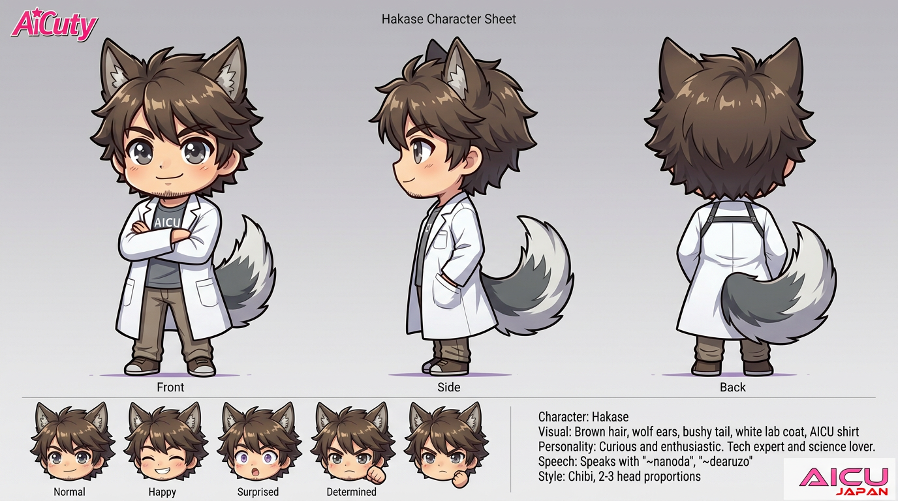

# AiCuty Character Sheet — Hakase / 博士

## Hakase / 博士

> **注意: 本シートは公式キャラクターシート画像（V2026, CHECKED_BY_HAKASE）から読み取れる内容のみで構成しています。**
> 博士は [AiCuty メンバー詳細（ルール）](https://docs.google.com/document/d/1i0EHSfAuAzHho8rhhaRLuPZR1Td6ASij98TWWduz7DE/edit) にも [docs/members.md](../docs/members.md) にも記載がなく、設定の大半が未確定です。末尾の「未定義項目」を参照。

| 項目 | 設定 |
|---|---|
| 名前 | Hakase / 博士 |
| 担当 | 技術専門家（Tech expert and science lover） |
| メンバーカラー | 未定義 |
| 楽器 | 未定義（バンド構成には不参加） |
| 誕生日 | 未定義 |
| 一人称 | 未定義 |

---

## ビジュアル

- 茶髪
- **狼耳**（wolf ears）
- ふさふさの尻尾（bushy tail）
- 白衣（white lab coat）
- AICU シャツ
- グレーの瞳、無精ひげ

表情差分は **Normal / Happy / Surprised / Determined** の4種（他メンバーの Normal / Happy / Shy / Surprised / Thinking とは構成が異なり、Shy・Thinking の代わりに **Determined** を持つ）。

---

## 性格

好奇心旺盛で熱心。技術のエキスパートで科学好き。

（原文: Curious and enthusiastic. Tech expert and science lover.）

---

## 話し方

公式シート記載の口調のみ:

- 語尾: **「〜なのだ」「〜であるぞ」**

---

## 役割

各メンバーのキャラクターシートには **`CHECKED_BY_HAKASE`** の検証署名が入っており、博士はキャラクター設定の監修・検証者として位置づけられていると読み取れます（要確認）。

---

## 関連アセット

- [img/anime/hakase.png](../img/anime/hakase.png)

---

## 未定義項目

以下はいずれの正本にも記載がないため、設定が必要です。

- [ ] AiCuty メンバー（No.1〜6）に含めるか、ナビゲーター／マスコットとして別枠にするか
- [ ] 正式名称（「Hakase」表記か「博士」表記か、フルネームの有無）
- [ ] メンバーカラー、誕生日、一人称
- [ ] 各メンバーからの呼び方／博士から各メンバーへの呼び方
- [ ] AICU media での担当領域（現在は5人＋Marsha のみ定義）
- [ ] 公式AIデザインルール（Checkpoint / LoRA / Seed / プロンプト）— 他6人と異なり未策定
- [ ] ComfyUI ワークフロー JSON — `AiCuty-Workflows/` に博士のファイルは存在しない
- [ ] 獣人（狼耳・尻尾）設定の扱い — 他メンバーは全員人間型のため、世界観上の位置づけの説明が必要か
