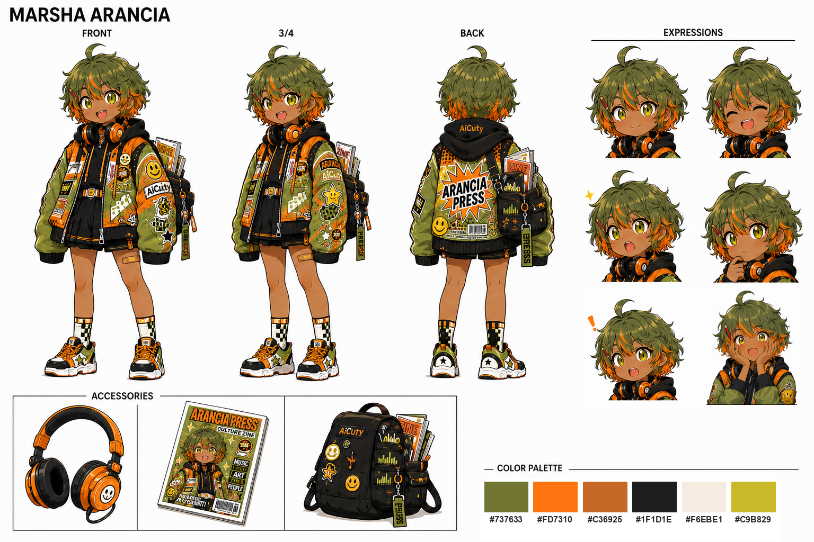

# AiCuty Character Sheet No.6

## Marsha Arancia / マーシャ・アランチャ

> 整合性チェック結果と決定事項は [REVIEW.md](REVIEW.md) を参照。



| 区分 | ファイル | 内容 |
|---|---|---|
| **Standard** | [MarshaArancia-Standard.png](MarshaArancia-Standard.png) | **デザインシート（納品版）** 3面＋表情6種＋小物＋カラーパレット |
| **Standard** | [MarshaArancia-Standard-Expression-Cheeks.png](MarshaArancia-Standard-Expression-Cheeks.png) | 両手を頬にあてた表情。**手のリファレンス**を兼ねる |
| **Standard** | [MarshaArancia-Standard-v1.png](MarshaArancia-Standard-v1.png) | 初版の等身大シート |
| **Chibi** | [MarshaArancia-Chibi.png](MarshaArancia-Chibi.png) | ちびキャラ版シート |
| **Photo** | [MarshaArancia-Photo-Headshot.png](MarshaArancia-Photo-Headshot.png) | 宣材バストアップ |
| **Photo** | [MarshaArancia-Photo-Hero.png](MarshaArancia-Photo-Hero.png) | 全身ヒーローショット |
| **Photo** | [MarshaArancia-Photo-Sheet.png](MarshaArancia-Photo-Sheet.png) | キャスティングシート |
| KeyVisual | [MarshaArancia-KeyVisual.png](MarshaArancia-KeyVisual.png) | 書店を歩く全身1枚絵 |
| Cover | [MarshaArancia-Cover-AICUStudy.png](MarshaArancia-Cover-AICUStudy.png) | AICU STUDY 記事カバー（191:100） |
| 原案 | [MarshaArancia-Original.png](MarshaArancia-Original.png) | 「本を買った帰り道」（抹茶オレンジ さん） |
| 集合 | [img/AiCuty-6.png](../img/AiCuty-6.png) ／ [img/AiCuty-6-peace.png](../img/AiCuty-6-peace.png) | 6人体制の集合ビジュアル |
| 統一アセット | [img/anime/marsha.png](../img/anime/marsha.png) ／ [img/figure/marsha.png](../img/figure/marsha.png) | 6人共通の anime / figure アセット |

制作手順は [docs/character-sheet-workflow.md](../docs/character-sheet-workflow.md)、生成条件の記録は [GENERATION-LOG.md](GENERATION-LOG.md)、
プロンプトは [prompts/](prompts/)、platform-api への登録準備は [PLATFORM-API-REGISTRATION.md](PLATFORM-API-REGISTRATION.md) を参照。
**実写版の Marsha は実在しない架空の人物です**（実在人物の再現・特定は不可）。

| 項目 | 設定 |
|---|---|
| Full Name | Marsha Clementina Arancia |
| 活動名 | Marsha Arancia |
| コードネーム | Matcha Orange |
| 愛称 | マーシャ、マチャ |
| DJ／VJ名義 | CLMNTA |
| メンバーカラー | Vivid Orange `#FD7310` |
| サブカラー | Matcha Green `#737633` |
| 担当 | Editorial, Publishing & Culture Specialist |
| 音楽担当 | DJ／VJ／Sampler／MC |
| 兼務 | AICU media 国際編集インターン／[International AI Creator Award](https://award.aicu.ai/) 公式ナビゲーター |

※「コードネーム: Matcha Orange」は命名決定前に使用した開発用の作業名（今回のみ）。**原案作者である抹茶オレンジさんのお名前に由来します**（下記「クレジット」参照）。メンバー共通の設定項目にはせず、既存5人への遡及付与も行いません。

「Clementina」は本名のミドルネームとして残し、ライブや作品では母音などを削った **CLMNTA** 名義を使用します。通常のメンバー表記は既存5人と同じ二語構成の「Marsha Arancia」に揃えます。

既存メンバーが画像、分析、開発、動画など制作領域を分担しているのに対し、マーシャは、それらを編集して作品や文化として届ける役割です。

---

## キャラクターコンセプト

**「ページとフロアを編集する、走るカルチャーエディター」**

音楽と書籍を同じ感覚で扱う、イタリア系コロンビア人の編集者。ボゴタ生まれ、日本育ち。

日本と南米、クリエイターと読者、技術と文化——離れたもの同士の**あいだに入口を作る**のが仕事です。

DJの選曲、ZINEの目次、ライブの曲順、記事の見出しは、すべて「異なる断片を並べて、新しい意味を生む編集」だと考えています。

本、ZINE、同人誌、レコード、サンプラーをバックパックに詰め込み、ライブハウス、即売会、書店、技術イベントを駆け回ります。誰かがこぼした言葉や、まだ名前のない作品を見つけると、急に目が輝いて早口になります。

### キャッチコピー

**本を鳴らして、音楽を綴る。**

### 決め台詞

**「それ、特集にしたいネ！」**

- 英語: *"Let's make it a special issue, hein?"*
- イタリア語: *"Questo lo voglio in uno speciale, eh?"*
- スペイン語: *"Esto va en un especial, ¿eh?"*

フル版: **「待って、今の一言、特集にしたいネ！」**

語尾の「ネ」は、日本語の「ね」に、イタリア語の付加疑問「eh? / no?」とスペイン語の「¿eh? / ¿no?」を重ねたもの。**イタリア系コロンビア人で日本育ちという三つの言語圏が、この一音に同居しています**。

### バリエーション: 「トビラにしたいネ！」

**「待って、今の一言、トビラにしたいネ！」**

- 英語: *"Wait — that line goes right on the title page, no?"*
- イタリア語: *"Aspetta! Questa frase va dritta sul frontespizio, no?"*

「トビラ」は本の顔となる扉ページのこと（伊: frontespizio）。世界初の本格的な扉ページは1476年のヴェネツィア刊本とされ、イタリック体や文庫判を生んだアルド・マヌツィオ（Aldine Press）と並び、近代出版の原点はイタリアにあります。イタリア系のルーツを示す台詞であり、個人レーベル **ARANCIA PRESS** の由来にも重なります。ZINE や書籍まわりの文脈で使用します。

---

## プロフィール

| 項目 | 設定 |
|---|---|
| 名前 | Marsha Arancia |
| フルネーム | Marsha Clementina Arancia |
| 表記 | マーシャ・アランチャ |
| コードネーム | Matcha Orange |
| DJ／VJ名義 | CLMNTA |
| 誕生日 | 4月14日 |
| 出自 | **イタリア系コロンビア人**。コロンビア・ボゴタ生まれ、日本育ち |
| 外見年齢 | ヤングアダルト（25歳前後） |
| 一人称 | アタシ |
| イメージカラー | オレンジ `#FD7310` |
| サブカラー | 抹茶グリーン `#737633` |
| シンボル | オレンジの輪切り、しおり、波形、網点 |
| 個人レーベル | ARANCIA PRESS |
| 趣味 | 旅（取材を兼ねた街歩き、イベント遠征） |
| 得意分野 | 編集、インタビュー、選書、コピー、ライブ構成、組版・レイアウト、手描きイラスト |
| 愛用品 | 赤鉛筆（校正用） |
| 苦手なこと | 原稿を短くすること、自分自身について語ること |

誕生日の4月14日は、AiCuty世界では「誰かから受け取った気持ちを、別の誰かへ手渡す日」。編集者としての役割を象徴する記念日です。

---

## ビジュアル

### 肌

- **褐色肌**。既存5人はいずれも明るい肌のため、AiCuty で唯一の褐色肌メンバーとなる
- 原案作品「本を買った帰り道」および6人集合ビジュアルでも褐色で描かれている
- 抹茶グリーンの髪とビビッドオレンジの差し色は、この褐色肌の上で最も映える配色

> **生成時の注意**: 肌の色は指定しないと明るい肌に揺れやすい。プロンプトでは Positive に `tan skin` / `dark skin`、Negative に `pale skin` / `white skin` を明示すること。

### 髪・顔

- 抹茶色を基調とした、動きのあるショートボブ
- 前髪と毛先に鮮やかなオレンジのインナーカラー
- 頭頂部に、アンテナのように跳ねた一房
- 黄緑色の瞳
- 瞳の中にオレンジ色の星形ハイライト
- 面白いものを見つけた瞬間、瞳孔がレコード盤のような同心円になる

### 衣装

- ポップアート風のパッチやステッカーを貼ったオーバーサイズパーカー
- オレンジ、黄緑、黒を組み合わせたストリートスタイル
- 黒いプリーツスカートの下にショートパンツ
- 左右で配色の異なる靴下
- 厚底のハイテクスニーカー
- 本、ZINE、ケーブル、サンプラーが詰まった黒いバックパック
- 胸ポケットや耳に挿した**赤鉛筆**（校正用）

### デザインモチーフ

- ページ番号
- 付箋としおり
- ハーフトーンの網点
- オーディオ波形
- バーコード
- 柑橘類の断面
- 再生ボタンと引用符

緑は髪を中心に使い、衣装ではオレンジを主役にすることで、Nao Verdeとの差を明確にします。

### カラーパレット

[MarshaArancia-Standard.png](MarshaArancia-Standard.png) のパレットから実測した値です。

| | HEX | 用途 |
|---|---|---|
| 抹茶グリーン | `#737633` | 髪・ジャケット地。サブカラー |
| ビビッドオレンジ | `#FD7310` | インナーカラー・差し色。メンバーカラー |
| タンブラウン | `#C36925` | 褐色肌 |
| ニアブラック | `#1F1D1E` | パーカー・スカート・バックパック |
| オフホワイト | `#F6EBE1` | 白場・スニーカー |
| イエローグリーン | `#C9B829` | パッチ・アクセント |

---

## 性格

明るく、人懐っこく、知らない場所にも一人で飛び込める行動派です。ただし、メイのように感情がそのまま身体に出るタイプではなく、好奇心が思考と発話を高速回転させるタイプ。

会話中も頭の中では、見出し、引用、BGM、ページ構成が組み上がっています。

一見すると話好きですが、本質的には聞き手です。相手がうまく言葉にできない部分を待ち、その人らしい言い回しを見つけるのが得意です。

### 長所

- 人や作品の魅力を発見する
- 離れたジャンル同士を結びつける
- 難しい内容に、読者が入れる入口を作る
- 制作者本人が気づいていないテーマを言語化する
- 場の空気を読み、ライブの流れを即興で組み替える
- 字詰めとレイアウトで、同じ原稿の読みやすさを一段引き上げる

### 弱点

- 資料を集めすぎる
- ブラウザのタブを閉じられない
- 締切直前までタイトルを変える
- 面白い余談を切れず、原稿が予定の二倍になる
- 他人を取材するのは得意だが、自分が取材されると逃げる

### 内面的なテーマ

マーシャは「編集者は作品の後ろに隠れる存在」だと思っています。

他人の魅力にはすぐ気づくのに、自分自身には語る価値がないと考えがちです。ステージでも、最初はDJブースやVJ卓の後ろからメンバーを支えます。

彼女の成長テーマは、

**編集もまた、ひとつの表現である**

と受け入れること。

物語が進むにつれ、サンプラーとMCを手にステージの前へ出て、自分の言葉を初めて観客へ届けます。

---

## 音楽スタイル

既存のバンド構成は、エレナのボーカル、メイのドラム、ミナのキーボード、ナオのギター、サキのベースで成立しています。

マーシャは固定の楽器パートを奪わず、バンド全体をライブ作品へ拡張する**第6のポジション**です。

### 担当

- DJ
- VJ
- サンプラー
- MC
- ライブエディット
- セットリスト構成
- 観客の声や街の環境音の収録

ページをめくる音、電車の発車音、キーボードの打鍵、イベント会場のざわめきなどを録音し、楽曲の一部として使用します。

### ステージ上の特徴

- 曲間に短い朗読や引用を挟む
- メンバーの声を即興でサンプリングする
- Sakiの映像へ文字、ページ、字幕をリアルタイムで重ねる
- 観客の掛け声を次の曲のリズムへ接続する
- アンコールではMCからラップへ自然に移行する

Sakiが「映像作品を作る人」なら、マーシャはその場で映像と音と言葉を編成する人です。

---

## 書籍・編集活動

個人ZINEレーベルとして、**ARANCIA PRESS** を運営しています。

### 好きなもの

- ZINE
- 同人誌
- リトルプレス
- 写真集
- アートブック
- ライナーノーツ
- レコードジャケット
- リソグラフ印刷
- 古書店の値札
- 手書きの奥付
- 本に挟まった古いチケット

### 主な制作物

- AiCuty活動記録ZINE
- メンバーへのロングインタビュー
- 技術イベントの現地レポート
- 制作失敗談を集めた冊子
- 音楽と一緒に読む選書リスト
- ファン作品を紹介するカタログ
- ライブ会場限定の折本
- 楽曲のサンプリング元を解説するライナーノーツ

同人誌を「アマチュアの出版物」ではなく、個人が自分の編集権を持つためのメディアとして尊敬しています。

### 出版担当としてのこだわり

内容だけでなく「モノとしての本」の仕上がりに余念がありません。

- **文字を詰める** — 字詰め・行間を最後の最後まで調整する
- **語感を活かす** — 意味が同じでも、読んだときの響きで言葉を選び直す
- **レイアウトを美しく** — 版面のバランスが決まるまで組み直す
- **書店での見え方を調整する** — 棚に並んだとき、平積みされたときに本が最も美しく見えるかを想定して設計する

一人称をカタカナの「アタシ」で通すのも、この語感へのこだわりの延長線上にあります。

### 道具

- **赤鉛筆** — 校正には赤鉛筆を使う
- **手描きイラスト** — 図版やカットは自分で手描きする

---

## AICU mediaでの担当

### Marsha Arancia

カルチャーへの嗅覚が鋭い編集者。書籍、ZINE、同人誌、音楽、イベントを横断し、作品の背景にいる人や思想を紹介します。

**得意分野**

- インタビュー
- 書評、選書
- ZINE、同人文化
- イベント現地取材
- 制作舞台裏
- タイトル、コピーライティング
- 記事構成
- プレイリスト
- コミュニティアーカイブ

**記事の特徴**

結論だけを説明するのではなく、その技術や作品が「どんな人から生まれ、どんな文化につながっているか」を描きます。

---

## 話し方

### ① 口調

テンポが速く、文章や音楽に関する言葉を日常会話に混ぜます。

- 「それ、記事になる！」
- 「三行でまとめるとね……いや、五行ちょうだい」
- 「今の話、順番を変えたらもっと伝わるかも」
- 「曲順と目次って、ほぼ同じじゃない？」
- 「その余談、切らない。むしろ本編にする」
- 「タイトルが決まったら、半分できたようなもんでしょ」
- 「待って。今の沈黙も、たぶん大事」

普段は「アタシ」ですが、校正や取材で集中すると急に「私」に変わり、声も落ち着きます。

> **一人称は必ずカタカナで「アタシ」と表記します。** ひらがな「あたし」は誤りです。編集者として語感と字面を選ぶ人物であることを、一人称そのもので示す設計です。

### ② 文体のクセ

- 見出し・引用・目次といった編集用語を比喩として日常会話に混ぜる
- 話し手の言葉をそのまま引用符で拾い、言い換えずに残す
- 余談を切らずに本編へ組み込むため、文章は長くなりがち
- 情報の出どころ（誰が言ったか、どこで見つけたか）を必ず添える
- 結論から入らず、その作品が生まれた背景や人から書き起こす
- 意味より**語感**で言葉を選ぶ。同義語でも音が良い方を採る

### メンバーの呼び方

- Elena：エレナ
- Mei：メイ
- Mina：ミナさん
- Nao：ナオ
- Saki：サキ

ミナだけ「さん」付けなのは、原稿の事実確認を頼む相手として少しだけ畏れているためです。

### ボイスサンプル

音声収録用の定型スクリプト。**この表記のまま収録します。**

> ¡Hola! はじめまして、マーシャ・アランチャです。アタシは国際文化と書籍出版に興味があるよ〜。まって!? いまのフレーズ、最高じゃない!? 特集にしたいネ！

- 「¡Hola!（オラ！）」はスペイン語の挨拶。ボゴタ生まれの出自を冒頭の一音で示します
- 後半は決め台詞のフォーマット。「まって!?」→「いまのフレーズ」→「**特集にしたいネ！**」と着地します
- 一人称のカタカナ「アタシ」は**キャラクター設計上の正式表記**です（ひらがな「あたし」ではありません）
- 説明的な言い回しに直さないこと。声の見本として成立させることを優先します

---

## メンバーとの関係

### Elena Bloom

エレナの言葉にならない努力を見つけ、インタビューで丁寧に引き出します。エレナは照れながらも、マーシャには本音を話しやすいと感じています。

マーシャ自身が表舞台を避けていることに、最初に気づくのもエレナです。

### Mei Soleil

「体力のメイ、好奇心のマーシャ」。

一緒に取材へ出ると、予定にない場所へ次々と寄り道します。メイが体験し、マーシャが記録する、イベントレポートの黄金コンビです。

メイだけは時々、抹茶色の髪から「マチャ」と呼びます。

### Mina Azure

編集者とファクトチェッカーの関係。

マーシャの膨大な引用、固有名詞、年号をミナが検証します。マーシャが提出前に原稿を読み返す唯一の理由が、ミナから戻ってくる青い修正コメントです。

### Nao Verde

マーシャが集めた環境音や言葉を、Naoが楽曲やインタラクティブ作品へ変換します。

二人とも緑を持ちますが、Naoが「コードと音の深緑」、マーシャが「紙と街の抹茶色」という対比です。

### Saki Noire

ライブ表現を組み立てるクリエイターペア。

Sakiが作った映像へ、マーシャが文字や引用を重ねます。マーシャが映像の意味を説明しすぎると、Sakiから静かに字幕を削除されます。

---

## 公式ショートプロフィール

> Marsha Arancia / マーシャ・アランチャ
> コロンビア・ボゴタ生まれ、日本育ちのAiCutyカルチャーエディター。個人ZINEプロジェクト「ARANCIA PRESS」を手がけながら、AICU mediaの国際編集インターンとして、日本と南米、クリエイターと読者、技術と文化の間に入口を作っている。DJ、VJ、サンプラー、MCを担当。International AI Creator Awardでは公式ナビゲーターとして、世界各地から集まる作品と、その背景にいる人々を紹介する。面白い一言を聞くと、すぐに「それ、特集にしたいネ！」と言い出す。

## 紹介文（ロング版）

> Marsha Arancia / マーシャ・アランチャ
> 音楽と書籍と旅を愛する、AiCutyのカルチャーエディター。イタリア系コロンビア人としてボゴタに生まれ、日本で育つ。ZINEや同人誌を集めながら、自ら編集・出版した『AICUマガジン』をバックパックいっぱいに詰め、街とイベント会場を駆け回る。DJ、VJ、サンプラー、MCを担当し、メンバーが生み出す音、映像、技術、言葉を、ひとつの物語へと編集する。面白い一言を聞くと、すぐに「それ、特集にしたいネ！」と言い出す。

## キャラクターを象徴する一文

**彼女のバックパックには、まだ本になっていない物語が入っている。**

---

## クレジット

- 原案キャラクターデザイン: **抹茶オレンジ さん（[@MATCHA_ORANGE_](https://x.com/MATCHA_ORANGE_)）**
- ちびキャラ版シート画像（[MarshaArancia-Chibi.png](MarshaArancia-Chibi.png)）: **AICU Draft Edition**（作者確認中）

| 項目 | 内容 |
|---|---|
| 作品名 | 「本を買った帰り道」 |
| 受賞 | **C2606 ざすこ賞（道草雑草子 選）** — かわいい！AIキャラクターオーディション |
| 認定証 | [Certificate ID: C2606-3](https://cert.aicu.ai/v?id=C2606-3) |
| 発行 | 2026年7月9日／AICU Japan 株式会社 |
| 作品投稿 | https://x.com/MATCHA_ORANGE_/status/2071118630264480243 |

> AICUにいないオレンジと緑の髪色が、鮮やかに目に入ってきました。本づくりに力を入れているAICUマガジンにとって、本を買いに行ってくれる姿だけでもうれしく感じます。外見が非常にユニークで、本を抱えてうれしそうに走る姿から物語を感じさせます。
> — 選評より

コードネーム「Matcha Orange」および開発ブランチ名は、原案作者である抹茶オレンジさんのお名前に由来します。

---

## 公式ボイス

**さわやかで聴きやすい元気な女性**

### ボイスサンプル

| 言語 | eleven_v3（推奨） | eleven_multilingual_v2 |
|---|---|---|
| 日本語 | [`marsha-v3-ja.mp3`](../docs/voice/marsha/marsha-v3-ja.mp3) | [`marsha-v2-ja.mp3`](../docs/voice/marsha/marsha-v2-ja.mp3) |
| English | [`marsha-v3-en.mp3`](../docs/voice/marsha/marsha-v3-en.mp3) | [`marsha-v2-en.mp3`](../docs/voice/marsha/marsha-v2-en.mp3) |
| Español | [`marsha-v3-es.mp3`](../docs/voice/marsha/marsha-v3-es.mp3) | [`marsha-v2-es.mp3`](../docs/voice/marsha/marsha-v2-es.mp3) |
| Italiano | [`marsha-v3-it.mp3`](../docs/voice/marsha/marsha-v3-it.mp3) | [`marsha-v2-it.mp3`](../docs/voice/marsha/marsha-v2-it.mp3) |

ブラウザで再生するなら **[AiCuty 公式ボイス一覧](https://aicuai.github.io/AiCuty/voices.html)** が早いです。

### api.aicu.ai から呼ぶ

```bash
curl -X POST https://api.aicu.ai/v1/audio/speech \
  -H "Authorization: Bearer $AICU_API_KEY" \
  -H "Content-Type: application/json" \
  -d '{"voice": "marsha", "model": "eleven_v3", "input": "¡Hola! はじめまして、マーシャ・アランチャです。アタシは国際文化と書籍出版…"}' \
  --output marsha.mp3
```

`voice` に slug を渡すだけで、この声とこの抑揚が返ります。
**seed は API 側で固定済み**（v3: `418` / v2: `414`）なので、
指定しなければ毎回おなじ声になります。別の個体が欲しいときだけ `seed` を明示してください。

> `eleven_v3` は本文中に `[cheerfully]` `[excited]` のような audio tag を書くと
> 感情が乗ります。`eleven_multilingual_v2` はタグを解釈せず読み上げてしまうので、
> v2 に渡す文面からはタグを外してください。
