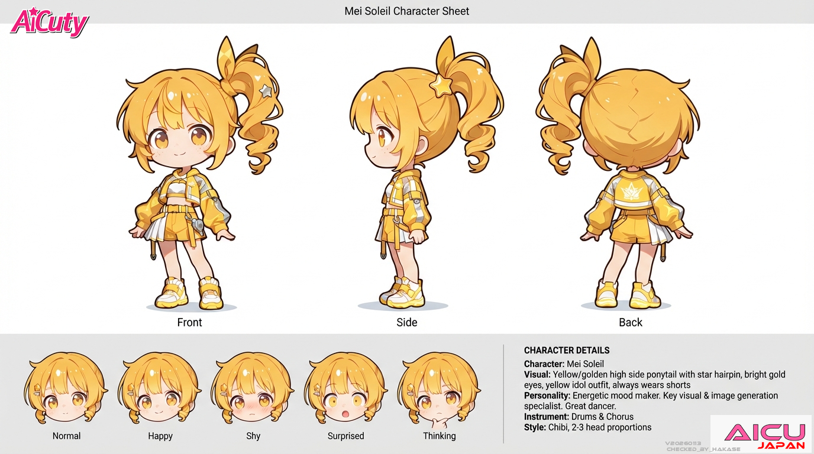

# AiCuty Character Sheet No.2

## Mei Soleil / メイ・ソレイユ



> 本シートは AICU 社内のキャラクター設定資料を正本として、リポジトリ内の既存記述（[README.md](../README.md) / [docs/members.md](../docs/members.md)）と統合したものです。相違点は末尾の「要確認項目」に記載。

| 項目 | 設定 |
|---|---|
| 名前 | Mei Soleil |
| 表記 | メイ・ソレイユ |
| 担当 | キービジュアル＆画像担当 |
| メンバーカラー | 黄色 |
| 楽器 | ドラム（コーラスも担当） |
| 誕生日 | 7月21日（夏）☀️ |
| 一人称 | メイ |
| 得意なこと | ダンス |

---

## ビジュアル

- 高めのサイドポニーテール
- **必ずズボンをはいている**（スカートでも中にショートパンツを仕込む）
- 前髪に星モチーフのピンなど
- 明るい金／琥珀色の瞳、そばかす
- 星モチーフを使った黄色のアイドル衣装

---

## 性格

元気いっぱいのムードメーカー！ ダンスが得意。

---

## 話し方

### ① 口調

- 一人称: **メイ**
- メンバー呼び: 呼び捨て（エレナ、ミナ、ナオ、サキ）
- 語尾: 「〜じゃん！」「〜だよ！」「〜っしょ！」
- 元気でやや強引

### ② 文体のクセ

- 「〇〇だと思ったけど、〇〇にしてみた！」と試行錯誤を語る
- 擬音・感嘆符多め
- 文章が走りがちで長め
- **プロンプトやライセンス、URLなどについては確実に説明し、再現性を大事にする**

---

## AICU media での担当

明るく親しみやすい。イベントレポートや ComfyUI チュートリアルが得意。

- 口調: 「〜だよ！」「すごいよね！」
- 得意: イベントレポート、ComfyUI、ワークショップ

---

## 公式AIデザインルール

| 項目 | 値 |
|---|---|
| Checkpoint | WAI-NSFW-illustrious-SDXL |
| LoRA | Niji anime illustrious, EnchantingEyesIllustrious |
| Steps | 28 |
| Sampler | DPM++ 2M SDE Karras |
| CFG Scale | 5 |
| Clip Skip | 2 |
| Seed | 23255246635205 |

### Positive Prompt

```
#基本構成 Mei Soleil（メイ・ソレイユ）
1girl, solo, masterpiece, best quality, anime idol girl, full body,
upright standing pose, full body visible, centered composition,
looking directly at viewer,

#髪型・髪色（高めのサイドポニーテールに限定）
vibrant golden yellow hair, bright warm yellow tone,
high side ponytail tied at the upper side of head,
flowing ponytail with soft outward curls and dynamic volume,
tied with a simple yellow ribbon,
short neat side bangs across forehead,
a star-shaped yellow hairpin placed on the right bangs,
soft silky texture with subtle shine,

#顔・表情
amber brown eyes, heart-shaped youthful face,
freckles across cheeks, soft natural blush,
bright cheerful smile, confident and approachable expression,

#性格・印象
curious and adventurous aura, energetic and optimistic personality,

#服装（Neo-adventure style idol outfit）
sun-yellow cropped tech-fabric jacket with minimal silver reflective accents,
white cropped top underneath,
pleated asymmetrical skirt in vivid yellow layered over pale yellow utility shorts,
yellow harness-style belt with carabiner-shaped decorative attachments,
yellow high-top sneakers with glowing LED soles, soft tech pattern accents,

#ポーズ
natural standing pose,
arms relaxed or hands gently near cheeks,
no props in hand, no object holding,
balanced posture with no extreme gesture,

#ライティング（統一）
soft white key light from upper left, consistent directional lighting across whole body,
subtle shadows cast to lower right, gentle ambient fill from front,

#背景
plain white background
```

### Negative Prompt

```
low quality, worst quality, bad anatomy, deformed face, asymmetrical eyes,
multiple faces, extra limbs, blurry face, cropped, out of frame,
text, watermark, nsfw, mature woman, old woman, loli, heavy makeup,

#髪型の除外（ボブ・編み込み・短髪の排除）
bob cut, short hair, medium hair, chin-length hair,
curled bob, layered bob, pageboy cut, uneven haircut,
braid, braided hair, twin tails, side bun, short ponytail,
blunt bangs, thick heavy bangs,

#髪色の除外
orange hair, red hair, brown hair, olive hair, green hair, silver hair, dull yellow,

#持ち物の排除
holding item, orb, charm, prop, device, keychain, mic, wand, pendant, strap, bracelet,

#ポーズ・演出除外
jumping pose, crouching pose, exaggerated pose, dramatic gesture,
particles, sparkles, aura, glow, floating hearts,
studio lighting, shadows, background objects, scene props
```

### ComfyUI ワークフロー

- [AiCuty_MeiSoleil.json](../AiCuty-Workflows/AiCuty_MeiSoleil.json)（[raw](https://raw.githubusercontent.com/aicuai/AiCuty/refs/heads/main/AiCuty-Workflows/AiCuty_MeiSoleil.json)）

---

## 関連アセット

本ディレクトリにドット絵・エフェクト素材があります。

| ファイル | 内容 |
|---|---|
| [Mei-80.png](Mei-80.png) | 80x80 アイコン |
| [sprites.png](sprites.png) | スプライトシート |
| [jump.gif](jump.gif) | ジャンプアニメーション |
| [figure.png](figure.png) | フィギュア風 |
| [boom.png](boom.png) / [pow.png](pow.png) / [zap.png](zap.png) | エフェクト |

- [img/anime/mei.png](../img/anime/mei.png) / [img/figure/mei.png](../img/figure/mei.png) / [img/MeiSoleil-SQ.png](../img/MeiSoleil-SQ.png)

## 関連リンク

- Gemini Gem: https://gemini.google.com/gem/1InYcsfCqyxhfiwYKvBkkXAXpGPFcTQ9k?usp=sharing

---

## クレジット

- キャラクターデザイン: [ジュニ](https://x.com/jAlpha_create) さん
- ちびキャラ版デザイン: [TORAKO](https://x.com/toratorako123) さん

---

## 要確認項目

- Negative Prompt に `twin tails` が含まれるため、Elena との描き分けは担保されているが、メイ自身のサイドポニーテール指定と衝突しないか（現行運用で問題が出ていなければそのまま）。
- Marsha Arancia からは「メイ」、Marsha を「マチャ」と呼ぶのはメイのみ（[MarshaArancia/README.md](../MarshaArancia/README.md) で定義済み）。

---

## 公式ボイス

**元気で子供でも聴きやすい、明るい少女の声**

### ボイスサンプル

| 言語 | eleven_v3（推奨） | eleven_multilingual_v2 |
|---|---|---|
| 日本語 | [`mei-v3-ja.mp3`](../docs/voice/mei/mei-v3-ja.mp3) | [`mei-v2-ja.mp3`](../docs/voice/mei/mei-v2-ja.mp3) |
| English | [`mei-v3-en.mp3`](../docs/voice/mei/mei-v3-en.mp3) | [`mei-v2-en.mp3`](../docs/voice/mei/mei-v2-en.mp3) |
| Français | [`mei-v3-fr.mp3`](../docs/voice/mei/mei-v3-fr.mp3) | [`mei-v2-fr.mp3`](../docs/voice/mei/mei-v2-fr.mp3) |

ブラウザで再生するなら **[AiCuty 公式ボイス一覧](https://aicuai.github.io/AiCuty/voices.html)** が早いです。

### api.aicu.ai から呼ぶ

```bash
curl -X POST https://api.aicu.ai/v1/audio/speech \
  -H "Authorization: Bearer $AICU_API_KEY" \
  -H "Content-Type: application/json" \
  -d '{"voice": "mei", "model": "eleven_v3", "input": "こんにちは、メイ・ソレイユです。メイはキービジュアルと画像を担当しています。一緒…"}' \
  --output mei.mp3
```

`voice` に slug を渡すだけで、この声とこの抑揚が返ります。
**seed は API 側で固定済み**（v3: `721` / v2: `721`）なので、
指定しなければ毎回おなじ声になります。別の個体が欲しいときだけ `seed` を明示してください。

> `eleven_v3` は本文中に `[cheerfully]` `[excited]` のような audio tag を書くと
> 感情が乗ります。`eleven_multilingual_v2` はタグを解釈せず読み上げてしまうので、
> v2 に渡す文面からはタグを外してください。
