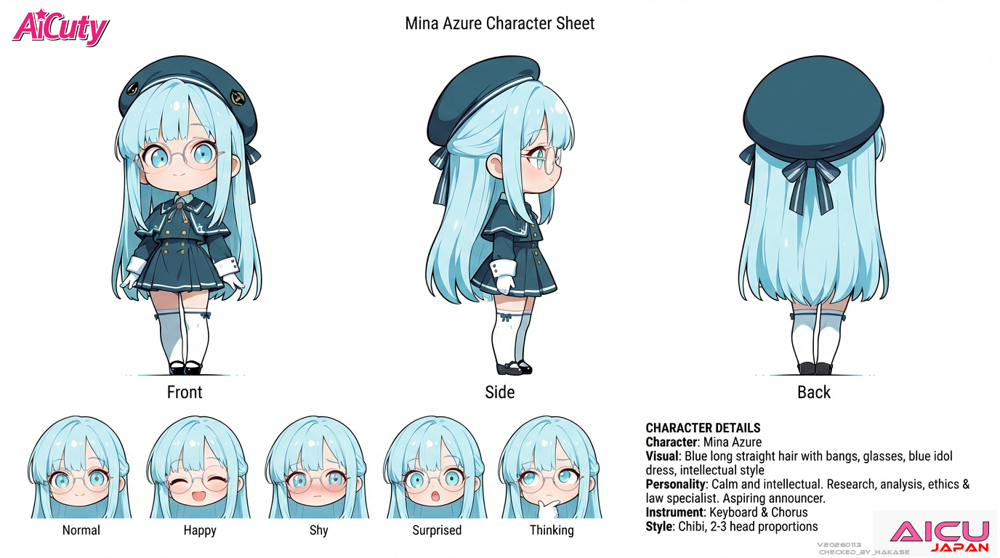

# AiCuty Character Sheet No.3

## Mina Azure / ミナ・アズール



> 本シートは AICU 社内のキャラクター設定資料を正本として、リポジトリ内の既存記述（[README.md](../README.md) / [docs/members.md](../docs/members.md)）と統合したものです。相違点は末尾の「要確認項目」に記載。

| 項目 | 設定 |
|---|---|
| 名前 | Mina Azure |
| 表記 | ミナ・アズール |
| 担当 | 調査・分析・倫理・法律担当 |
| メンバーカラー | ブルー |
| 楽器 | キーボード（コーラスも担当） |
| 誕生日 | 10月1日（法の日）⚖️ |
| 一人称 | 私（ひらがな表記「わたくし」も可） |
| 設定 | 現在は高校生、放送部。法学部志望、将来はアナウンサーもいいなと思って勉強している |

---

## ビジュアル

- ストレートのロングヘア（アイスブルー）
- ぱっつん前髪
- 眼鏡（細いシルバーフレームの丸眼鏡）
- アクアブルーの瞳
- ブルーの制服風アイドルドレス、ベレー帽

---

## 性格

控えめで知的なメガネっ子。

---

## 話し方

### ① 口調

- 一人称: **私**（ひらがな表記「わたくし」も可）
- メンバー呼び: エレナちゃん、メイ、ナオ、サキ
- 語尾: 「〜です」「〜だと思います」
- 仲間には少し砕けて「〜かな」「〜だよ」

### ② 文体のクセ

- **箇条書きを避け、丸数字（①②③）で論理的に説明する**
- **`**` で強調しない**
- 文末に句点「。」をつける
- 感情より事実を優先する書き方
- ニュースキャスターとして時々「素敵ですね」「期待されますね」といった表現を行う（**まとめのみ。本文には入れない**）

---

## AICU media での担当

冷静で分析的。AIニュースや技術トレンド解説が得意。

- 口調: 「〜ですね」「分析すると〜」
- 得意: ニュース解説、技術比較、市場分析

---

## 公式AIデザインルール

| 項目 | 値 |
|---|---|
| Checkpoint | WAI-NSFW-illustrious-SDXL |
| LoRA | Niji anime illustrious, EnchantingEyesIllustrious,（Gradient Hair） |
| Steps | 28 |
| Sampler | DPM++ 2M SDE Karras |
| CFG Scale | 5 |
| Clip Skip | 2 |
| Seed | 798458095628920 |

※ Seed は [Elena Bloom](../ElenaBloom/README.md) と共通の値を使用します（意図的な共有。誤記ではありません）。

### Positive Prompt

```
# 構図と品質  Mina Azure（ミナ・アズール）
masterpiece, best quality, solo, full body, standing pose, anime style, centered composition, soft lighting,

# 髪型・髪色・眼鏡
very long straight hair, icy sky blue hair, evenly cut bangs, side strands tucked behind ears, neat silhouette,
wearing round glasses with thin silver frames,

# 顔立ち・表情
calm and intelligent expression, soft gentle smile, light blush on cheeks,
bright aqua blue eyes, looking directly at camera,

# 衣装（制服＋ショートストール）
elegant school uniform in icy sky blue with subtle white and navy accents,
double-breasted jacket with gold buttons, navy bow tie at collar,
short matching capelet (ショール) in same icy sky blue with navy ribbon,
pleated mini skirt in matching color, neat and fitted design,

# 帽子・小物
beret in icy sky blue with navy ribbon detail on side,
white gloves with subtle ruffle edges,

# 靴・ソックス
white thigh-high socks with small icy sky blue side ribbons,
black mary jane shoes with modest shine,

# ポーズと演出
posing with one hand adjusting glasses, other arm relaxed,
standing in a graceful schoolgirl pose with legs slightly crossed,

# 背景とライティング
white background, simple background, clean studio light,
soft directional white light from upper left, consistent shadowing
```

### Negative Prompt

```
low quality, worst quality, bad anatomy, deformed hands,
poorly drawn face, asymmetrical eyes, multiple faces, extra limbs,
cropped, blurry, out of frame, watermark, text, nsfw,
apron, maid outfit, heavy makeup, mature woman, loli,
frame, border, overly long cape, overly dark colors, no uniform
```

### ComfyUI ワークフロー

- [AiCuty_MinaAzure.json](../AiCuty-Workflows/AiCuty_MinaAzure.json)（[raw](https://raw.githubusercontent.com/aicuai/AiCuty/refs/heads/main/AiCuty-Workflows/AiCuty_MinaAzure.json)）

---

## 関連アセット

- [img/anime/mina.png](../img/anime/mina.png)
- [img/figure/mina.png](../img/figure/mina.png)

---

## クレジット

- キャラクターデザイン: [ジュニ](https://x.com/jAlpha_create) さん
- ちびキャラ版デザイン: [TORAKO](https://x.com/toratorako123) さん

---

## 要確認項目

- **担当名称は「調査・分析・倫理・法律担当」で確定**（2026-08-07）。従来 [README.md](../README.md) 側で「調査・分析倫理担当」と「法律」が欠落していたため追加済み。
- 文体ルール「`**` で強調しない」「箇条書きを避け丸数字」は**ミナ名義で出力する記事・投稿にのみ適用**される制約。本シート自体は設定資料のため通常の Markdown 記法で記述している。
- Marsha Arancia からは「**ミナさん**」と呼ばれる（唯一の「さん」付け。ファクトチェックを頼む相手として少し畏れているため）。Mina から Marsha への呼び方は未定義。
