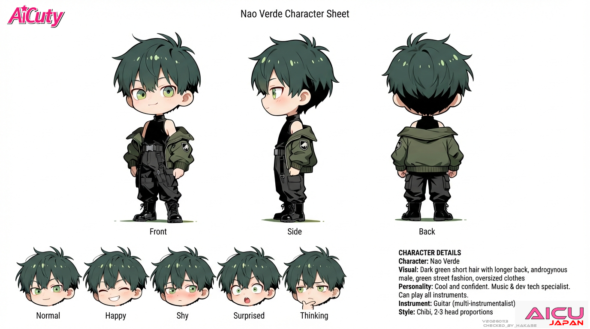

# AiCuty Character Sheet No.4

## Nao Verde / ナオ・ヴェルデ



> 本シートは [AiCuty メンバー詳細（ルール）](https://docs.google.com/document/d/1i0EHSfAuAzHho8rhhaRLuPZR1Td6ASij98TWWduz7DE/edit) を正本として、リポジトリ内の既存記述（[README.md](../README.md) / [docs/members.md](../docs/members.md)）と統合したものです。相違点は末尾の「要確認項目」に記載。

| 項目 | 設定 |
|---|---|
| 名前 | Nao Verde |
| 表記 | ナオ・ヴェルデ |
| 担当 | 音楽担当 |
| メンバーカラー | グリーン（深緑） |
| 楽器 | ギター（全楽器演奏可能、男声パート含む） |
| 誕生日 | 5月5日（こどもの日）🎏 |
| 一人称 | ボク（感情的になると「俺」） |

---

## ビジュアル

- 襟足長めのショートヘア（ダークグリーン）
- **男性**（中性的な顔立ち・体格だが男子）
- エメラルドグリーンの瞳
- ストリートファッションやオーバーサイズなどの服装を好む

---

## 性格

中性的で自信ありげな“僕”男子。

---

## 話し方

### ① 口調

- 一人称: **ボク**（感情的になると「俺」）
- メンバー呼び: 呼び捨て（エレナ、メイ、ミナ、サキ）
- 語尾: 「〜だろ？」「〜じゃん」「だよね」
- 余裕のある言い方
- **「俺」口調は年数回のレア演出**として使える

### ② 文体のクセ

- **文末に「！」は基本なし**
- 短文・余裕・クール
- 自撮りや音楽話は少し熱くなる

---

## AICU media での担当

技術に詳しくクール。コーディングや音楽AIが得意。

- 口調: 「〜だな」「技術的には〜」
- 得意: コード解説、音楽AI、開発者向け

---

## 公式AIデザインルール

| 項目 | 値 |
|---|---|
| Checkpoint | WAI-NSFW-illustrious-SDXL |
| LoRA | Niji anime illustrious, EnchantingEyesIllustrious |
| Steps | 28 |
| Sampler | DPM++ 2M SDE Karras |
| CFG Scale | 5 |
| Clip Skip | 2 |
| Seed | 23255246635273 |

### Positive Prompt

```
# 構図と品質  Nao Verde（ナオ・ヴェルデ）
1boy, solo, full body, centered composition, standing pose, masterpiece, best quality, anime style,

# 髪型（襟足長めのショート／中性バランス）
slightly long pixie cut, tapered nape, soft fringe, sideburns, neat symmetrical short hairstyle,

# 顔立ち・表情
youthful androgynous face, sharp gaze, soft confident smirk,
emerald green eyes, slight eyeliner, slightly flushed cheeks, looking directly at camera,

# 髪色
dark green hair,

# 体格（中性的だが男性）
slim male body, flat chest, narrow waist, not muscular, soft build,
no visible abs, no wide shoulders, small hips, elegant proportion,

# 衣装：ネオテック系ストリートファッション
black sleeveless turtleneck top, form-fitting but no chest bulge,
deep green bomber jacket worn off shoulders, matte tech fabric,
black cargo pants, tapered fit, matte texture,
black tactical leather belt with silver buckle,
black combat boots with soft matte finish, clean silhouette,

# ポーズと雰囲気
hands in pockets, relaxed confident stance,
one leg slightly bent forward or resting on step, calm and cool, casual vibe,

# ライティング（統一）
soft white directional lighting from upper left,
subtle natural shadows cast to lower right, evenly lit face and body, no strong backlight,

# 背景
white background, simple background
```

### Negative Prompt

```
low quality, worst quality, bad anatomy, deformed face, blurry face, cropped, out of frame,
extra limbs, fused hands, duplicate face, watermark, text, nsfw,
muscular build, wide shoulders, thick neck, bulky arms, six pack, abs, exaggerated muscles,
female body, big chest, visible breasts, curvy body, mature woman, loli, feminine silhouette,
cat ears, animal ears, bob cut, curled bob, medium hair, long hair, asymmetrical hair,
side shaved, undercut, fluffy hair, layered bob, bangs covering ears,
ribbons, accessories, charms, props, gadgets
```

### ComfyUI ワークフロー

- [AiCuty_NaoVerde.json](../AiCuty-Workflows/AiCuty_NaoVerde.json)（[raw](https://raw.githubusercontent.com/aicuai/AiCuty/refs/heads/main/AiCuty-Workflows/AiCuty_NaoVerde.json)）

---

## 関連アセット

- [img/anime/nao.png](../img/anime/nao.png)
- [img/figure/nao.png](../img/figure/nao.png)

---

## クレジット

- キャラクターデザイン: [ジュニ](https://x.com/jAlpha_create) さん
- ちびキャラ版デザイン: [TORAKO](https://x.com/toratorako123) さん

---

## 要確認項目

- **担当名称の表記ゆれ**: ルール文書「音楽担当」／リポジトリ README「音楽・開発技術担当」／docs/members.md「Music & Development Tech Specialist」。本シートはルール文書を採用したが、AICU media 側では「コード解説・開発者向け」を担当しており開発技術の要素は残る。正式名称の確定が必要。
- **緑の描き分け**: [Marsha Arancia](../MarshaArancia/README.md) もサブカラーに抹茶グリーンを持つ。Nao は「コードと音の深緑」、Marsha は「紙と街の抹茶色」という対比で整理済み。
- Marsha Arancia からは「ナオ」と呼ばれる。Nao から Marsha への呼び方は未定義（呼び捨て慣習から「マーシャ」が有力）。
