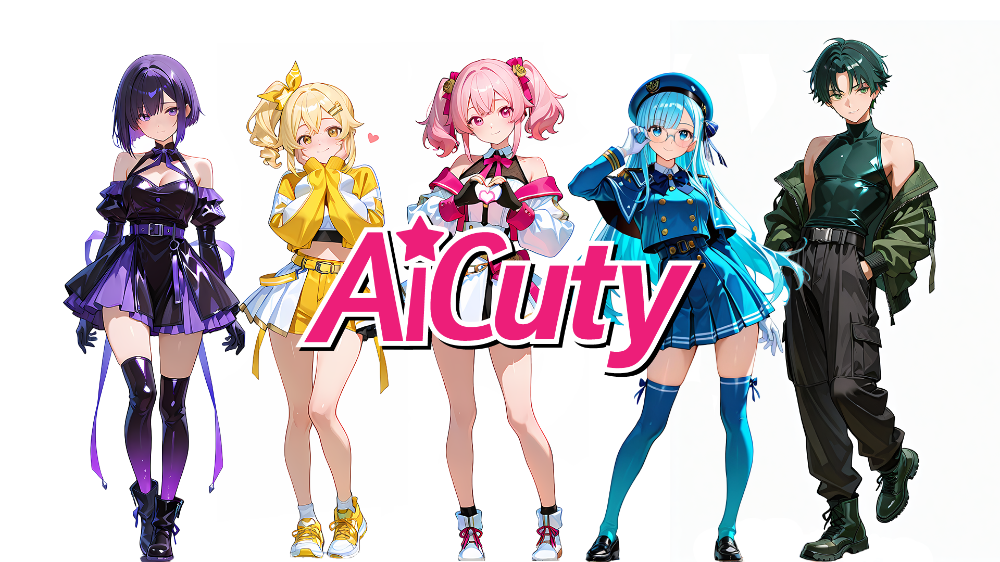

# AiCuty

人とAIがつくるアイドルプロジェクトのデザイン共有サイトです



## AiCutyコミュニティライセンスとガイドライン

最新のライセンスとガイドラインはこちらのURLで公開されています。

https://www.aicu.jp/terms/aicuty-guideline

## 公式AIデザインルール

### 使い方

- [超初心者向け AiCutyを標準プロンプトで作ってみた！](https://www.aicu.jp/post/aicuty-20250902)

以下のファイルをダウンロードして ComfyUI のインストールディレクトリに配置してください。

- ComfyUI Desktop Mac版の場合は Finder で 書類→ComfyUI→models 以下のフォルダになります。

1. checkpointsフォルダに「waiNSFWIllustrious_v140.safetensors」を配置

- 入手元 [WAI-NSFW-illustrious-SDXL](https://civitai.com/models/827184/wai-nsfw-illustrious-sdxl)
 - License: [Illustrious License](https://freedevproject.org/faipl-1.0-sd/)
 - 上記のFAIPLに加えて、「生成AIサービスでの使用を許可しない」と明記されたモデルなので、AICUとしては別のモデルによる準公式プロンプトも検討中です。個人の環境にダウンロードして使う上では問題がないと考えます。

2. loras に以下の2つのファイルを配置

- Niji_anime_illustrious.safetensors https://civitai.com/models/1261988/niji-anime-style-illustriousorfluxorpony

- EnchantingEyesIllustrious.safetensors https://civitai.com/models/974076/enchanting-eyes-detailed-eyes?modelVersionId=1463317

 ※Civitaiへのユーザー登録が必要です

3. upscale_models に RealESRGAN_x4Plus Anime 6B を配置

- RealESRGAN_x4plus_anime_6B.pth   https://github.com/xinntao/Real-ESRGAN/releases/download/v0.2.2.4/RealESRGAN_x4plus_anime_6B.pth

[配布元](https://github.com/xinntao/Real-ESRGAN/blob/master/docs/anime_model.md)


4. 生成したいキャラクターのワークフローJSONファイルか PNGファイルを入手

- Elena Bloom [JSON](https://raw.githubusercontent.com/aicuai/AiCuty/refs/heads/main/ElenaBloom/ElenaBloom.json) [PNG](https://raw.githubusercontent.com/aicuai/AiCuty/refs/heads/main/ElenaBloom/ElenaBloom.png)
 
5. ComfyUIを起動して左上の[C]メニューのファイルから読み込み
   
6. 一度生成してみて(Cmd+Enter)ファイルが足りないなどのエラーがないことを確認する

7. KSampler設定を確認する

 - Steps：28
 - Sampler：DPM++ 2M SDE Karras
 - CFG Scale：5
 - Seed：固定 or キャラごとに指定します（例：Elena の場合は `798458095628920` )
 - Clip Skip：2
 - Aspect Ratio：1024x1536 or 832x1216（全身用）


### 詳細なAiCutyのAIデザイン制作過程について 詳しくは AICUマガジン Vol.15にて！

https://j.aicu.ai/MagV15

# 以下は初期の 設計プロンプトです

## 💛 Mei Soleil（メイ・ソレイユ）

Checkpoint：WAI-NSFW-illustrious-SDXL
LoRA：Niji anime illustrious, EnchantingEyesillustrious 
Steps：28
Sampler：DPM++ 2M SDE Karras
CFG Scale：5
Clip Skip：2
Seed：23255246635205

Positive Prompt
```
#基本構成 Mei Soleil（メイ・ソレイユ）
1girl, solo, masterpiece, best quality, anime idol girl, full body,
upright standing pose, full body visible, centered composition,
looking directly at viewer,

#髪型・髪色（高めのサイドポニーテールに限定）
vibrant golden yellow hair, bright warm yellow tone,
high side ponytail tied at the upper side of head,
flowing ponytail with soft outward curls and dynamic volume,
tied with a simple yellow ribbon,
short neat side bangs across forehead,
a star-shaped yellow hairpin placed on the right bangs,
soft silky texture with subtle shine,

#顔・表情
amber brown eyes, heart-shaped youthful face,
freckles across cheeks, soft natural blush,
bright cheerful smile, confident and approachable expression,

#性格・印象
curious and adventurous aura, energetic and optimistic personality,

#服装（Neo-adventure style idol outfit）
sun-yellow cropped tech-fabric jacket with minimal silver reflective accents,
white cropped top underneath,
pleated asymmetrical skirt in vivid yellow layered over pale yellow utility shorts,
yellow harness-style belt with carabiner-shaped decorative attachments,
yellow high-top sneakers with glowing LED soles, soft tech pattern accents,

#ポーズ
natural standing pose,
arms relaxed or hands gently near cheeks,
no props in hand, no object holding,
balanced posture with no extreme gesture,

#ライティング（統一）  
soft white key light from upper left, consistent directional lighting across whole body,  
subtle shadows cast to lower right, gentle ambient fill from front,

#背景
plain white background
```

Negative Prompt
```
low quality, worst quality, bad anatomy, deformed face, asymmetrical eyes,
multiple faces, extra limbs, blurry face, cropped, out of frame,
text, watermark, nsfw, mature woman, old woman, loli, heavy makeup,

#髪型の除外（ボブ・編み込み・短髪の排除）
bob cut, short hair, medium hair, chin-length hair,
curled bob, layered bob, pageboy cut, uneven haircut,
braid, braided hair, twin tails, side bun, short ponytail,
blunt bangs, thick heavy bangs,

#髪色の除外
orange hair, red hair, brown hair, olive hair, green hair, silver hair, dull yellow,

#持ち物の排除
holding item, orb, charm, prop, device, keychain, mic, wand, pendant, strap, bracelet,

#ポーズ・演出除外
jumping pose, crouching pose, exaggerated pose, dramatic gesture,
particles, sparkles, aura, glow, floating hearts,
studio lighting, shadows, background objects, scene props
```

## 💚 Nao Verde（ナオ・ヴェルデ）

Checkpoint：WAI-NSFW-illustrious-SDXL
LoRA：Niji anime illustrious, EnchantingEyesillustrious 
Steps：28
Sampler：DPM++ 2M SDE Karras
CFG Scale：5
Clip Skip：2
Seed：23255246635273

Positive Prompt
```
# 構図と品質  Nao Verde（ナオ・ヴェルデ）
1boy, solo, full body, centered composition, standing pose, masterpiece, best quality, anime style,

# 髪型（襟足長めのショート／中性バランス）  
slightly long pixie cut, tapered nape, soft fringe, sideburns, neat symmetrical short hairstyle,

# 顔立ち・表情  
youthful androgynous face, sharp gaze, soft confident smirk,  
emerald green eyes, slight eyeliner, slightly flushed cheeks, looking directly at camera,

# 髪色  
dark green hair,

# 体格（中性的だが男性）  
slim male body, flat chest, narrow waist, not muscular, soft build,  
no visible abs, no wide shoulders, small hips, elegant proportion,

# 衣装：ネオテック系ストリートファッション  
black sleeveless turtleneck top, form-fitting but no chest bulge,  
deep green bomber jacket worn off shoulders, matte tech fabric,  
black cargo pants, tapered fit, matte texture,  
black tactical leather belt with silver buckle,  
black combat boots with soft matte finish, clean silhouette,

# ポーズと雰囲気  
hands in pockets, relaxed confident stance,  
one leg slightly bent forward or resting on step, calm and cool, casual vibe,

# ライティング（統一）  
soft white directional lighting from upper left,  
subtle natural shadows cast to lower right, evenly lit face and body, no strong backlight,

# 背景  
white background, simple background
```

Negative Prompt
```
low quality, worst quality, bad anatomy, deformed face, blurry face, cropped, out of frame,  
extra limbs, fused hands, duplicate face, watermark, text, nsfw,  
muscular build, wide shoulders, thick neck, bulky arms, six pack, abs, exaggerated muscles,  
female body, big chest, visible breasts, curvy body, mature woman, loli, feminine silhouette,  
cat ears, animal ears, bob cut, curled bob, medium hair, long hair, asymmetrical hair,  
side shaved, undercut, fluffy hair, layered bob, bangs covering ears,  
ribbons, accessories, charms, props, gadgets
```

## ❤️ Elena Bloom（エレナ・ブルーム）

Checkpoint：WAI-NSFW-illustrious-SDXL
LoRA：Niji anime illustrious, EnchantingEyesillustrious , Gradient Hair
Steps：28
Sampler：DPM++ 2M SDE Karras
CFG Scale：5
Clip Skip：2
Seed：798458095628920

### Positive Prompt

```
# 構図と品質 Elena Bloom（エレナ・ブルーム）
masterpiece, best quality, solo, full body, sweet and gentle anime idol girl in center position, from front,
soft and affectionate personality, slightly shy warm smile,

# 髪型・装飾
fluffy twin tails tied high with big pastel pink ribbons and rose flower hair clips,
soft curled ends with subtle rose pink gradient,
choppy bangs, loose side bangs softly framing forehead,

# 顔立ち・表情
silky rose-pink hair, big bright sparkling pink eyes with soft highlights,
large expressive eyes, looking directly at camera, tidy silhouette,

# 衣装（ゴージャスで神聖なアイドルステージ衣装）
wearing a goddess-inspired idol stage outfit mainly in pastel pink and white with fine gold accents and subtle black trims:
off-shoulder flowing mini dress made of lightweight futuristic tech-fabric with soft iridescent glow and subtle sheer overlays along skirt edges,
layered skirt with outer bright pink tech-fabric and inner layer of airy semi-transparent white chiffon,
slim gold belt with tiny pink gemstone and subtle black edge lines,
cropped white bolero jacket with semi-sheer mesh sleeves and hem with faint see-through effect and pink piping,
subtle glowing circuit pattern on cuffs outlined with fine black piping,
fingerless lace gloves with tiny pink bows,
white ankle boots with subtle gold trims and small black edging at soles with small pink ribbon flares at back,

# ポーズ
standing in a cute idol pose with both hands forming a heart near chest,
looking directly at camera,

# 背景
white background, simple background, clean studio light,

# ライティング（統一指示）
soft directional white light from upper left, consistent shadowing across all elements
```

### Negative Prompt
```
low quality, worst quality, bad anatomy, poorly drawn face, deformed eyes,
asymmetrical eyes, multiple faces, extra limbs, cropped, blurry, out of frame,
watermark, text, nsfw, loli, mature woman, heavy makeup,
inconsistent outfit, duplicate costume
```


## 💙 Mina Azure（ミナ・アズール）

Checkpoint：WAI-NSFW-illustrious-SDXL
LoRA：Niji anime illustrious, EnchantingEyesillustrious , (Gradient Hair)
Steps：28
Sampler：DPM++ 2M SDE Karras
CFG Scale：5
Clip Skip：2
Seed：798458095628920

Positive Prompt
```
# 構図と品質  Mina Azure（ミナ・アズール）
masterpiece, best quality, solo, full body, standing pose, anime style, centered composition, soft lighting,

# 髪型・髪色・眼鏡  
very long straight hair, icy sky blue hair, evenly cut bangs, side strands tucked behind ears, neat silhouette,  
wearing round glasses with thin silver frames,

# 顔立ち・表情  
calm and intelligent expression, soft gentle smile, light blush on cheeks,  
bright aqua blue eyes, looking directly at camera,

# 衣装（制服＋ショートストール）  
elegant school uniform in icy sky blue with subtle white and navy accents,  
double-breasted jacket with gold buttons, navy bow tie at collar,  
short matching capelet (ショール) in same icy sky blue with navy ribbon,  
pleated mini skirt in matching color, neat and fitted design,

# 帽子・小物  
beret in icy sky blue with navy ribbon detail on side,  
white gloves with subtle ruffle edges,

# 靴・ソックス  
white thigh-high socks with small icy sky blue side ribbons,  
black mary jane shoes with modest shine,

# ポーズと演出  
posing with one hand adjusting glasses, other arm relaxed,  
standing in a graceful schoolgirl pose with legs slightly crossed,

# 背景とライティング  
white background, simple background, clean studio light,  
soft directional white light from upper left, consistent shadowing
```

Negative Prompt
```
low quality, worst quality, bad anatomy, deformed hands,  
poorly drawn face, asymmetrical eyes, multiple faces, extra limbs,  
cropped, blurry, out of frame, watermark, text, nsfw,  
apron, maid outfit, heavy makeup, mature woman, loli,  
frame, border, overly long cape, overly dark colors, no uniform
```

## 💜 Saki Noir（サキ・ノワール）

Checkpoint：WAI-NSFW-illustrious-SDXL
LoRA：Niji anime illustrious, EnchantingEyesillustrious , (Gradient Hair)
Steps：28
Sampler：DPM++ 2M SDE Karras
CFG Scale：5
Clip Skip：2
Seed：23255246635292

Positive Prompt
```
# 構図と品質 Saki Noir（サキ・ノワール）
1girl, solo, full body, centered composition, standing pose, masterpiece, best quality, anime style,

# 髪型（シャープで内巻きしないストレートボブ、左目にかかる前髪）
dark violet hair, sleek sharp straight bob cut, neat inward angle, clean ends, side bangs covering left eye, no hair curling at ends,

# 顔立ち・表情
slightly round youthful face, soft blush on cheeks,
big gentle amethyst eyes with clear detail,
confident and secretive small smile, looking directly at camera, symmetrical face,

# 衣装（黒＋紫基調のミステリアスで高級感あるアイドル衣装）
wearing a high-end mysterious idol stage outfit:
black off-shoulder top with deep midnight purple accents and subtle glowing violet circuit thread pattern,
double-layered skirt with outer layer in matte black and inner frill layer in soft metallic violet chiffon,
holographic gradient sheen along skirt hem in violet to black tones,
tight fitted techno-style waist belt with silver and purple buckle,
thigh-high glossy black boots with faint violet neon glow and ribbon detail around ankles,
gradient purple over-the-knee sheer socks blending into the boots,
minimal black gloves with violet trims,

# ポーズ
standing in secretive pose with one finger softly at lips,
body slightly angled, one leg relaxed, elegant and composed stance,

# 背景
white background, simple background, clean studio light,
```

Negative Prompt
```
low quality, worst quality, bad anatomy, poorly drawn face, deformed eyes,
asymmetrical eyes, multiple faces, extra limbs, cropped, blurry, out of frame,
watermark, text, nsfw, loli, mature woman, heavy makeup,
inconsistent outfit, duplicate costume, frilly white dress, fluffy skirt
```


