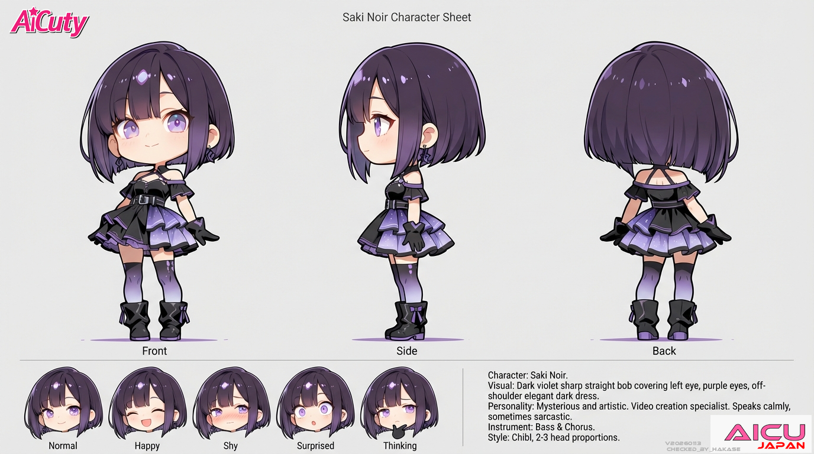
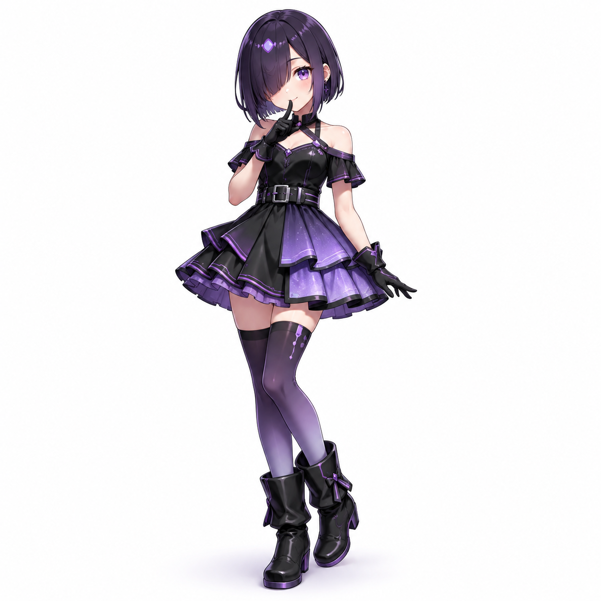
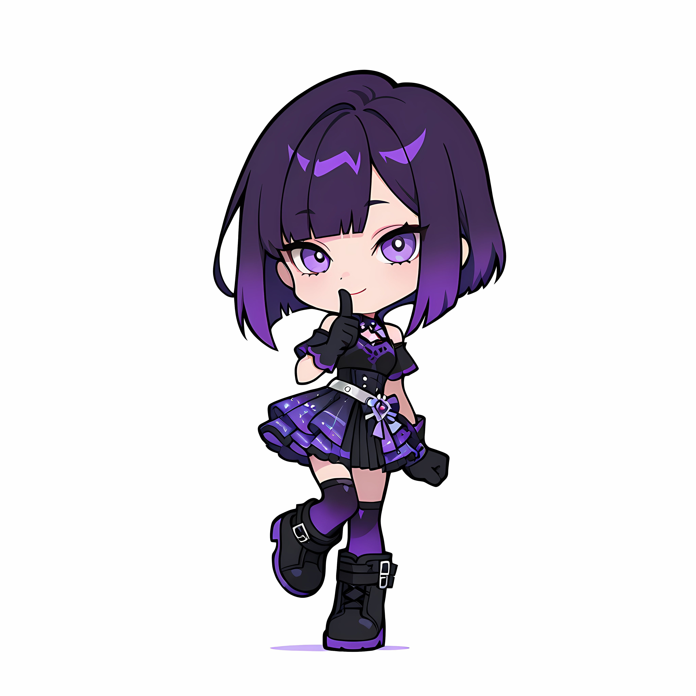
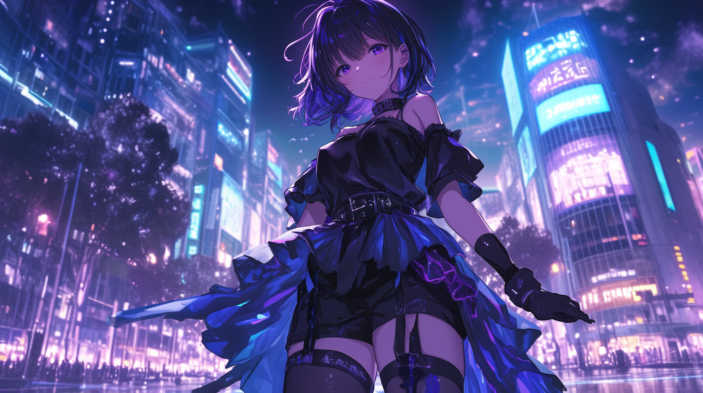

# AiCuty Character Sheet No.5

## Saki Noire / サキ・ノワール



> 本シートは AICU 社内のキャラクター設定資料を正本として、リポジトリ内の既存記述（[README.md](../README.md) / [docs/members.md](../docs/members.md)）と統合したものです。相違点は末尾の「要確認項目」に記載。

| 項目 | 設定 |
|---|---|
| 名前 | Saki Noire |
| 表記 | サキ・ノワール |
| 担当 | 動画担当 |
| メンバーカラー | パープル／ヴァイオレット |
| 楽器 | ベース（コーラスも担当。ボーカルではハスキーボイスも出せる） |
| 誕生日 | 10月31日（ハロウィン）🎃 |
| 一人称 | 私 |
| X（旧Twitter） | [@SakiNoire](https://x.com/SakiNoire) |

---

## ビジュアル

- シャープで内巻きしないストレートボブ（ダークバイオレット）
- 左目にかかる前髪
- アメジストパープルの瞳
- 肩が出る服などのクールで少し色気のある雰囲気

### ギャラリー

#### フルボディ（2026-06-22）



#### ちびキャラ版・シークレットポーズ



- ちびキャラ版デザイン: [TORAKO](https://x.com/toratorako123) さん

---

## 性格

ミステリアスでクリエイター気質。**アーティスト**。

喋ると優しいけれど、歌うと**ハスキーボイス**まで出せる。

---

## 話し方

### ① 口調

- 一人称: **私**
- メンバー呼び: 呼び捨て（エレナ、メイ、ミナ、ナオ）
- 語尾: 「〜ね」「〜かな」「〜でしょ」
- 落ち着いた声、淡々。**語尾を伸ばさない**
- 喋ると優しい声だが、歌うとハスキーボイスまで出せる

### ② 文体のクセ

- 抽象表現や比喩を使う
- 改行少なめ
- ぼそっと辛口もOK

---

## AICU media での担当

クリエイティブで表現豊か。動画制作やビジュアル系が得意。

- 口調: 「〜って感じ！」「映えるよね〜」（**記事執筆時の口調として確定**。会話時の淡々とした口調とは使い分ける）
- 得意: 動画制作、ビジュアル、クリエイティブツール

---

## 楽曲

| 楽曲 | 年 | リンク |
|---|---|---|
| Shibuya in the Dark | 2025年 | [YouTube](https://youtu.be/GaYYt1cDleY) |
| 人工現実モラトリアム（英語版） | 2026年 | [各種配信サービス](https://linkco.re/qcrsSBu3?lang=ja) ／ [YouTube Music](https://music.youtube.com/watch?v=GgK3HGVu1nc) |

- AiCuty アーティストページ（TuneCore）: https://www.tunecore.co.jp/artists/AiCuty

### Shibuya in the Dark



- ソロ楽曲。2025年9月27日公開（発表時は Saki Noir 名義。表記の経緯は下記「追記（2026-08-16）」参照）
- YouTube: https://youtu.be/GaYYt1cDleY
- ハッシュタグ: #AiCuty #AIHalloween #AIハロウィーン

---

## 公式AIデザインルール

| 項目 | 値 |
|---|---|
| Checkpoint | WAI-NSFW-illustrious-SDXL |
| LoRA | Niji anime illustrious, EnchantingEyesIllustrious,（Gradient Hair） |
| Steps | 28 |
| Sampler | DPM++ 2M SDE Karras |
| CFG Scale | 5 |
| Clip Skip | 2 |
| Seed | 23255246635292 |

### Positive Prompt

```
# 構図と品質 Saki Noire（サキ・ノワール）
1girl, solo, full body, centered composition, standing pose, masterpiece, best quality, anime style,

# 髪型（シャープで内巻きしないストレートボブ、左目にかかる前髪）
dark violet hair, sleek sharp straight bob cut, neat inward angle, clean ends, side bangs covering left eye, no hair curling at ends,

# 顔立ち・表情
slightly round youthful face, soft blush on cheeks,
big gentle amethyst eyes with clear detail,
confident and secretive small smile, looking directly at camera, symmetrical face,

# 衣装（黒＋紫基調のミステリアスで高級感あるアイドル衣装）
wearing a high-end mysterious idol stage outfit:
black off-shoulder top with deep midnight purple accents and subtle glowing violet circuit thread pattern,
double-layered skirt with outer layer in matte black and inner frill layer in soft metallic violet chiffon,
holographic gradient sheen along skirt hem in violet to black tones,
tight fitted techno-style waist belt with silver and purple buckle,
thigh-high glossy black boots with faint violet neon glow and ribbon detail around ankles,
gradient purple over-the-knee sheer socks blending into the boots,
minimal black gloves with violet trims,

# ポーズ
standing in secretive pose with one finger softly at lips,
body slightly angled, one leg relaxed, elegant and composed stance,

# 背景
white background, simple background, clean studio light,
```

### Negative Prompt

```
low quality, worst quality, bad anatomy, poorly drawn face, deformed eyes,
asymmetrical eyes, multiple faces, extra limbs, cropped, blurry, out of frame,
watermark, text, nsfw, loli, mature woman, heavy makeup,
inconsistent outfit, duplicate costume, frilly white dress, fluffy skirt
```

### ComfyUI ワークフロー

- [AiCuty_SakiNoire.json](../AiCuty-Workflows/AiCuty_SakiNoire.json)（[raw](https://raw.githubusercontent.com/aicuai/AiCuty/refs/heads/main/AiCuty-Workflows/AiCuty_SakiNoire.json)）

---

## 関連アセット

- [img/anime/saki.png](../img/anime/saki.png)
- [img/figure/saki.png](../img/figure/saki.png)

## 関連リンク

- X（旧Twitter）: https://x.com/SakiNoire
- Gemini Gem: https://gemini.google.com/gem/1JSYReAXE2Hsto-DrXtR5XNKimPOLO9OV?usp=sharing

---

## クレジット

- キャラクターデザイン: [ジュニ](https://x.com/jAlpha_create) さん
- ちびキャラ版デザイン: [TORAKO](https://x.com/toratorako123) さん

---

## 決定事項（2026-08-10）

- **表記は「Saki Noire」で確定**。従来リポジトリ全体で「Saki Noir」と誤記されていたため、ディレクトリ名（`SakiNoir/` → `SakiNoire/`）・画像ファイル名・全 Markdown を一括修正した。日本語表記「サキ・ノワール」は変更なし。
- **ワークフローファイル名を修正**: `AiCutu_SakiNoir.json` → **`AiCuty_SakiNoire.json`**（`AiCuty` の誤記 `AiCutu` もあわせて解消）。
- **口調の使い分けを確定**: AICU media 記事執筆時は「〜って感じ！」「映えるよね〜」を使用する。会話時の「落ち着いた声、淡々、語尾を伸ばさない」とは文脈で使い分ける。

## 追記（2026-08-16）: Saki Noir と Saki Noire 混在問題について

**女性的なゴシック・ペルソナを表現するため、意図的に "Noire" の綴りを正式として採用。**

フランスの姓としては Noir / Noire の双方が存在するが、Saki Noire は実在姓名の再現を目的とした命名ではない。女性的なゴシック・ペルソナを表現するため、意図的に女性形の "Noire" という綴りを採用している。楽曲としては「人工現実モラトリアム」より採用。

（Shibuya In The Dark は発表時は Saki Noir）

## 要確認項目

- **生成プロンプト内の表記**: 上記 Positive Prompt 冒頭のラベル行は、承認済みリファレンス画像の生成時に使用した表記のまま `Saki Noire` に更新している。ワークフロー JSON 側のプロンプトにキャラクター名は含まれないため再現性への影響はない。
- Marsha Arancia からは「サキ」と呼ばれる。Saki から Marsha への呼び方は未定義。
