# Nano Banana Pro でAiCutyキャラクターの一貫性を維持する方法

Gemini の画像生成モデル「Nano Banana Pro」(gemini-3-pro-image-preview) を使って、AiCutyメンバーの一貫したキャラクター画像を生成する方法をご紹介します。

## はじめに

AI画像生成で最も難しい課題の一つが「キャラクターの一貫性」です。同じキャラクターを異なるシーンで描く際、髪型、目の色、衣装などがバラバラになりがちです。

この問題を解決するため、私たちは**リファレンスシート方式**を採用しました。

## 制作ワークフロー：人間とAIのコラボレーション

このリファレンスシートは、アートディレクター（人間）とAI（Claude Code + Nano Banana Pro）の協働によって作られました。以下はその制作プロセスです。

### Step 1: 公式素材の準備

まず、既存の公式キャラクター画像（Chibi版）を参照素材として用意しました。これらは過去にStable Diffusionなどで生成・監修されたもので、各キャラクターの「正解」となる外見情報を含んでいます。

### Step 2: リファレンスシート生成

Claude Code が Nano Banana Pro API を使い、公式素材を参照しながらリファレンスシートを自動生成します。プロンプトでは以下を指定：

- 3面図（正面・横・後ろ）
- 5種類の表情差分
- キャラクター設定テキスト（英語）
- 16:9 レイアウト

```python
# 生成コードの例
response = client.models.generate_content(
    model="models/gemini-3-pro-image-preview",
    contents=contents,
    config=types.GenerateContentConfig(
        response_modalities=["IMAGE", "TEXT"],
        seed=314,  # 再現性のためのシード値
    ),
)
```

### Step 3: アートディレクターによるレビュー

生成された画像をアートディレクター（ハカセ）がチェックします。判定基準：

| チェック項目 | 詳細 |
|-------------|------|
| 髪型・髪色 | 公式設定通りか？ |
| 目の色・形 | キャラクターの特徴が出ているか？ |
| 衣装デザイン | アイドル衣装の再現度 |
| 表情の多様性 | 5種の表情が区別できるか？ |
| 全体の一貫性 | 3面図で同一人物に見えるか？ |

### Step 4: OK/NG判定と再生成

アートディレクターの判定：

- **OK** → 承認。ファイル名に「OK」を付けて保存
- **NG** → 却下。シード値を変えて再生成

実際のやり取り例：

```
Claude: Elenaのリファレンスシートを生成しました [画像]
ハカセ: 全然ダメ！顔がリファレンスと違う。やり直し！
Claude: シード値を変更して再生成します...
Claude: seed=314 で生成しました [画像]
ハカセ: OKとします！
```

### Step 5: シード値の発見

再現性を確保するため、各キャラクターで「良い結果が出るシード値」を探しました。

**アイデア**: シード値にキャラクターの誕生日（MMDD形式）を使用

これにより：
- 覚えやすい
- キャラクターごとに固有
- ファンにとっても親しみやすい

試行錯誤の結果、以下のシード値が採用されました：

| メンバー | 試行シード | 結果 | 採用シード |
|---------|-----------|------|-----------|
| Elena | 101, 202, **314** | 314でOK | 314 (3/14) |
| Mei | 701, **721** | 721でOK | 721 (7/21) |
| Mina | 1103(NG), 503(NG), **1001** | 1001でOK | 1001 (10/1) |
| Nao | **505** | 一発OK | 505 (5/5) |
| Saki | **1031** | 一発OK | 1031 (10/31) |

### Step 6: 公式ロゴの追加

承認されたシートにPIL/Pillowで公式ロゴを合成：

- 左上: AiCutyロゴ
- 右下: AICU Japanロゴ + バージョン情報

### 制作の教訓

1. **AIは提案、人間が決定**: AIが生成した画像を人間が判断することで品質を担保
2. **シード値は重要**: 同じプロンプトでもシード値で結果が大きく変わる
3. **複数候補から選ぶ**: 一発OKは稀。複数シードで生成し、最良を選ぶ
4. **NG判定を恐れない**: ダメなものはダメと言うことで品質が上がる
5. **記録を残す**: OK/NGの理由を記録し、次回に活かす

---

## リファレンスシートとは

リファレンスシートは、キャラクターの外見情報を1枚の画像にまとめたものです：

- **3面図**: 正面・横・後ろ姿
- **表情差分**: Normal, Happy, Shy, Surprised, Thinking
- **設定テキスト**: 外見・性格・楽器などの情報

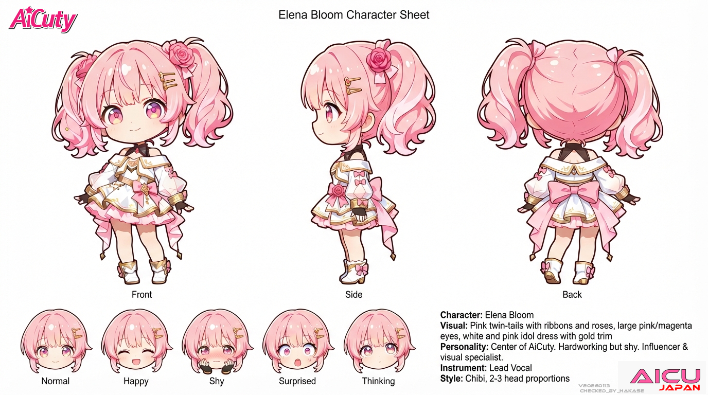

## 使い方

### 1. リファレンスシートを用意

`design2601/` フォルダに各メンバーのリファレンスシートがあります：

| メンバー | ファイル |
|---------|----------|
| Elena Bloom | `ElenaBloom2601OK314.png` |
| Mei Soleil | `MeiSoleil2601OK.png` |
| Mina Azure | `MinaAzure2601OK.png` |
| Nao Verde | `NaoVerde2601OK.png` |
| Saki Noir | `SakiNoir2601OK.png` |

### 2. プロンプトの書き方

基本構造：

```
Using this character reference sheet, generate a [タイプ] image.

Scene: [キャラ名] is [行動/状況]
- [視覚的詳細1]
- [視覚的詳細2]
- [カラースキーム]
- Speech bubble saying "[セリフ]"
- 16:9 horizontal aspect ratio

CRITICAL: Maintain EXACT character appearance from reference - [髪型], [目の色], [衣装].
```

### 3. プロンプト例

#### ブログカバー画像

```
Using this character reference sheet, generate a blog cover image.

Scene: Elena is excitedly presenting a new AI tool on her laptop
- She is sitting at a modern desk with a pink laptop
- Sparkles and UI elements floating around her
- Speech bubble saying "すごい発見！"
- 16:9 horizontal aspect ratio
- Bright, cheerful atmosphere

CRITICAL: Maintain EXACT character appearance from reference - pink twin-tails, pink eyes, outfit style.
```

**生成例:**


#### 漫画パネル

```
Using this character reference sheet, create a single manga panel.

Scene: Mei dancing happily
- Full body shot showing her dance move
- Motion lines and energy effects
- Speech bubble: "踊ろうよ！"
- Panel frame with black borders
- 16:9 aspect ratio

CRITICAL: Maintain EXACT character appearance - yellow side ponytail with star hairpin, gold eyes.
```

**生成例:**


#### チュートリアルサムネイル

```
Using this character reference sheet, generate a tutorial thumbnail.

Scene: Nao explaining coding concepts
- Pointing at floating code snippets
- Relaxed confident pose
- Green tech background
- 16:9 horizontal aspect ratio

CRITICAL: Maintain EXACT character appearance - dark green short hair, green eyes, androgynous male.
```

**生成例:**

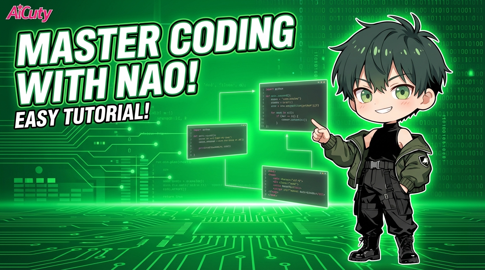

## 各キャラクターの特徴

プロンプトの `CRITICAL` セクションで指定すべき特徴：

### Elena Bloom
```
pink twin-tails with ribbons and roses, large pink/magenta eyes, white and pink idol dress with gold trim
```

### Mei Soleil
```
yellow/golden high side ponytail with star hairpin, bright gold eyes, yellow idol outfit, always wears shorts
```

### Mina Azure
```
blue long straight hair with bangs, glasses, blue idol dress, intellectual style
```

### Nao Verde
```
dark green short hair with longer back, androgynous male, green street fashion, oversized clothes
```

### Saki Noir
```
dark violet sharp straight bob covering left eye, purple eyes, off-shoulder elegant dark dress
```

## シード値について

再現性を高めるため、各キャラクターに誕生日ベースのシード値を設定しています：

| メンバー | シード | 誕生日（提案） |
|---------|--------|----------------|
| Elena | 314 | 3/14 ホワイトデー |
| Mei | 721 | 7/21 夏 |
| Mina | 1001 | 10/1 法の日 |
| Nao | 505 | 5/5 こどもの日 |
| Saki | 1031 | 10/31 ハロウィン |

```python
config=types.GenerateContentConfig(
    response_modalities=["IMAGE", "TEXT"],
    seed=314,  # Elena's birthday seed
)
```

## 生成例ギャラリー

### Elena Bloom

| Blog Cover | Manga Panel | Tech Tutorial |
|------------|-------------|---------------|
|  |  | 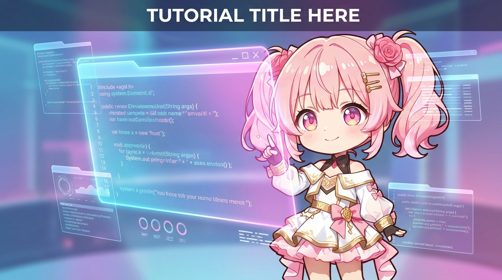 |

### Mei Soleil

| Blog Cover | Manga Panel | Tech Tutorial |
|------------|-------------|---------------|
| 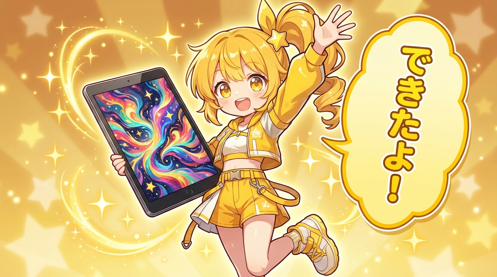 |  | 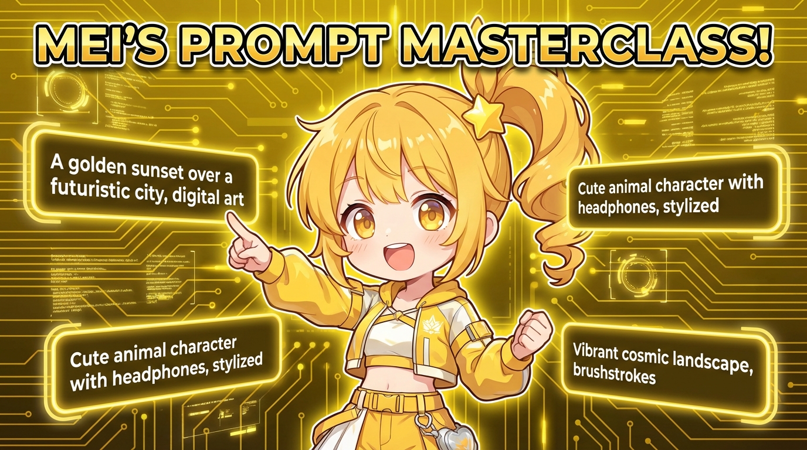 |

### Mina Azure

| Blog Cover | Manga Panel | Tech Tutorial |
|------------|-------------|---------------|
| 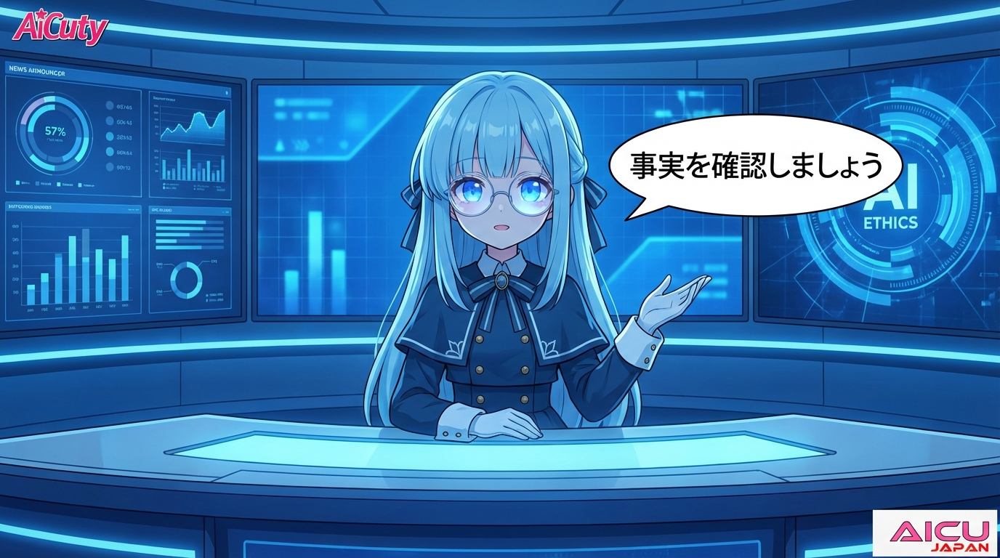 | 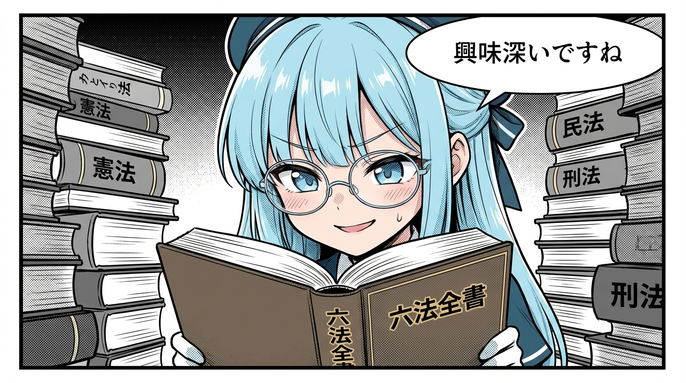 | 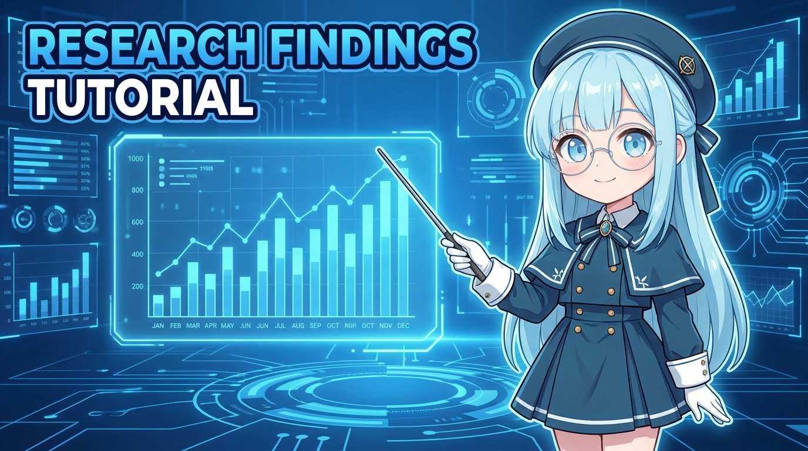 |

### Nao Verde

| Blog Cover | Manga Panel | Tech Tutorial |
|------------|-------------|---------------|
| 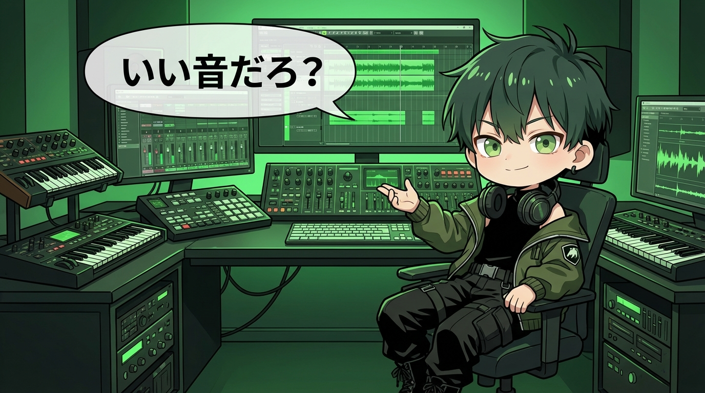 | 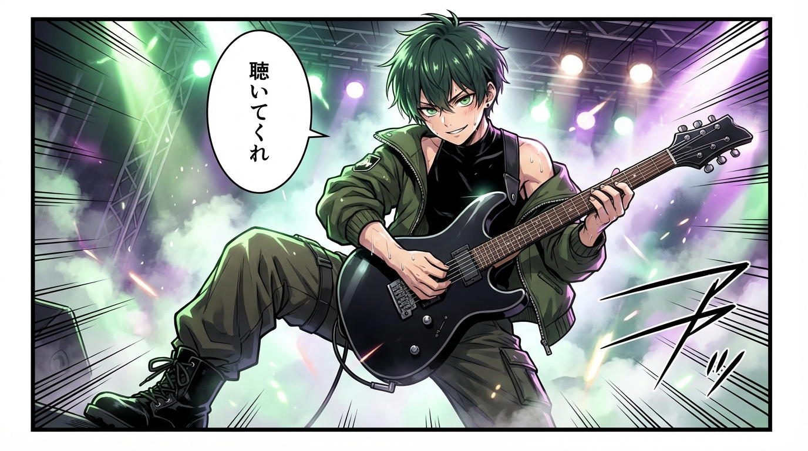 |  |

### Saki Noir

| Blog Cover | Manga Panel | Tech Tutorial |
|------------|-------------|---------------|
| 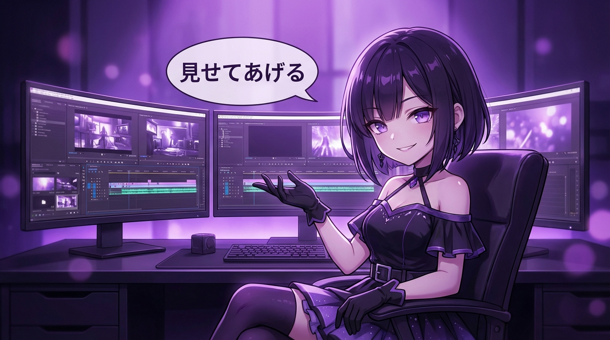 | 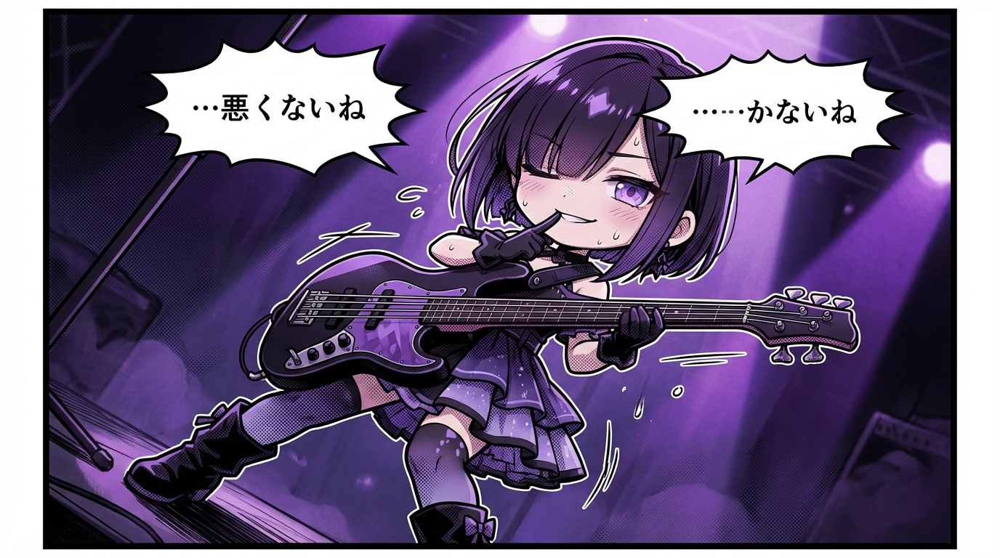 | 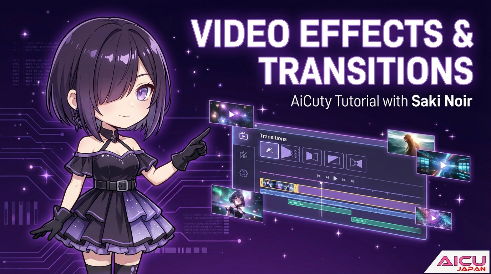 |

## Tips

1. **CRITICAL セクションは必須**: キャラクターの特徴を明示的に指定しないと一貫性が崩れます
2. **カラースキームを合わせる**: 背景やエフェクトもキャラクターカラーに合わせると統一感が出ます
3. **シード値を活用**: 気に入った結果が出たらシード値を記録しておきましょう
4. **16:9 を指定**: アスペクト比を明示するときれいなレイアウトになります

## ライセンス

AiCutyの二次創作については [AiCuty Guidelines](https://www.aicu.jp/terms/aicuty-guideline) をご確認ください。

---

Version: v20260113
Model: Gemini 3 Pro Image Preview (Nano Banana Pro)

© AICU Japan / AiCuty
